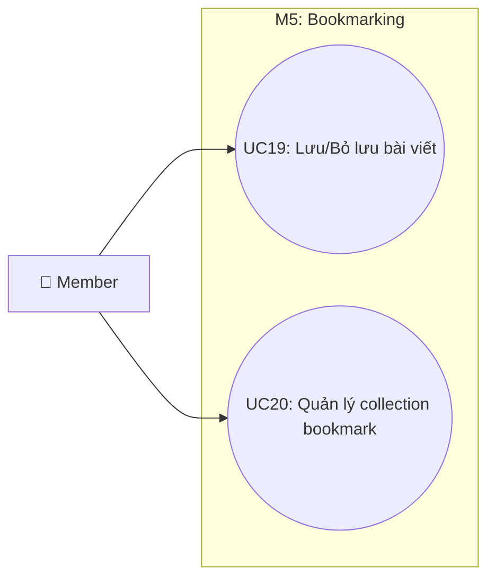

# Use Case M5: Bookmarking

> [!IMPORTANT]
> **Start here:** Nếu bạn chưa xem bản tổng quát hệ thống, hãy tham khảo [UseCase Overview](./use-case-overview.md).

## 1) Phân vùng chức năng (Domain Context)
Module M5 cho phép người dùng lưu trữ các bài viết yêu thích và tổ chức chúng vào các bộ sưu tập (Collections) cá nhân để xem lại sau này.

## 2) Traceability Table

| UC | Use Case | Module | FR |
|---|---|---|---|
| UC19 | Lưu/Bỏ lưu bài viết | M5.1 | FR-6 |
| UC20 | Quản lý collection bookmark | M5.2 | FR-6 |

## 3) Use Case Diagram

## 4) Cross-module Dependencies
- **M2**: Đối tượng được lưu (UC19) luôn là bài viết thuộc Module M2.
- **M3**: Người dùng thường thực hiện hành động lưu bài ngay khi đang xem bài trên News Feed. (Tham chiếu: [M3 Feed](./use-case-m3-discovery-feed.md))
