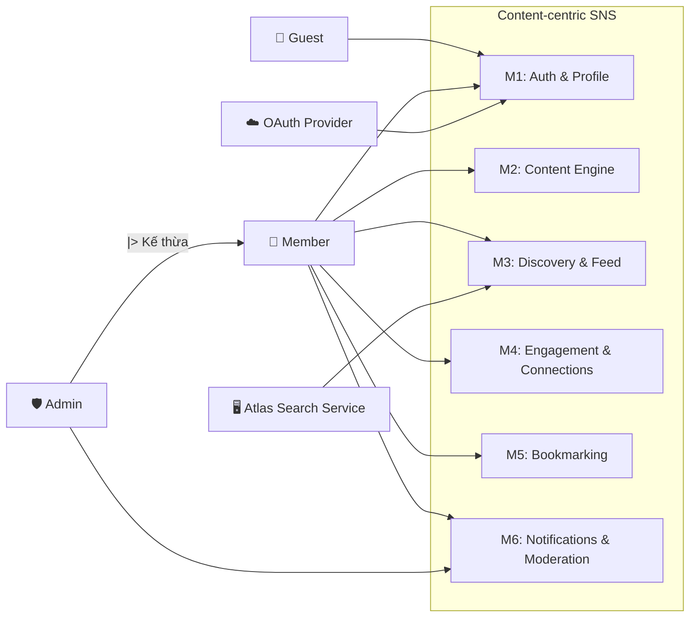

# Use Case System Overview

> **Mục tiêu:** Cung cấp cái nhìn toàn cảnh về ranh giới hệ thống (System Boundary), các tác nhân (Actors) và các nhóm chức năng chính. Tài liệu này giúp hiểu rõ "Ai" làm được "Gì" ở mức độ vĩ mô.

## 1) System Boundary: Content-centric SNS

Hệ thống tập trung vào việc quản lý nội dung, tương tác xã hội và phân phối dữ liệu dựa trên sở thích người dùng. Toàn bộ các chức năng được phân vùng thành 6 module từ M1 đến M6.

## 2) Actor Identification

| Actor | Loại | Vai trò nghiệp vụ | Truy vết |
|---|---|---|---|
| Guest | Primary | Người chưa xác thực, chỉ thao tác đăng ký/đăng nhập | FR-1 (M1.1) |
| Member | Primary | Người dùng đã xác thực, sử dụng các chức năng cốt lõi M1-M6 | FR-2..FR-10 |
| Admin | Primary (kế thừa Member) | Xử lý kiểm duyệt và duyệt báo cáo | FR-9 (M6.2.3) |
| External Services | Secondary (actor tổng quát) | Nhóm hệ thống tích hợp bên ngoài | Technical Decisions |
| OAuth Provider | Secondary (kế thừa External Services) | Xác thực OAuth cho đăng nhập social | FR-1 (M1.1.2) |
| Atlas Search Service | Secondary (kế thừa External Services) | Cung cấp full-text search + autocomplete | FR-7 (M3.2) |

### Actor Generalization
- `Admin` kế thừa toàn bộ quyền của `Member`.
- `OAuth Provider` và `Atlas Search Service` kế thừa từ `External Services`.

## 3) High-level Module Overview Diagram

Diagram này chỉ tập trung vào sự tương tác giữa Actor và các nhóm chức năng chính (Modules), không đi sâu vào từng Use Case nhỏ.

## 4) Drill-down Navigation

Để xem chi tiết từng Use Case trong từng module, hãy chọn liên kết tương ứng:

1. [M1: Auth & Profile](./use-case-m1-auth-profile.md)
2. [M2: Content Engine](./use-case-m2-content-engine.md)
3. [M3: Discovery & Feed](./use-case-m3-discovery-feed.md)
4. [M4: Engagement & Connections](./use-case-m4-engagement-connections.md)
5. [M5: Bookmarking](./use-case-m5-bookmarking.md)
6. [M6: Notifications & Moderation](./use-case-m6-notifications-moderation.md)

---
*Lưu ý: Mọi chi tiết về quan hệ <<include>>, <<extend>> được mô tả tại tài liệu chi tiết từng module.*
