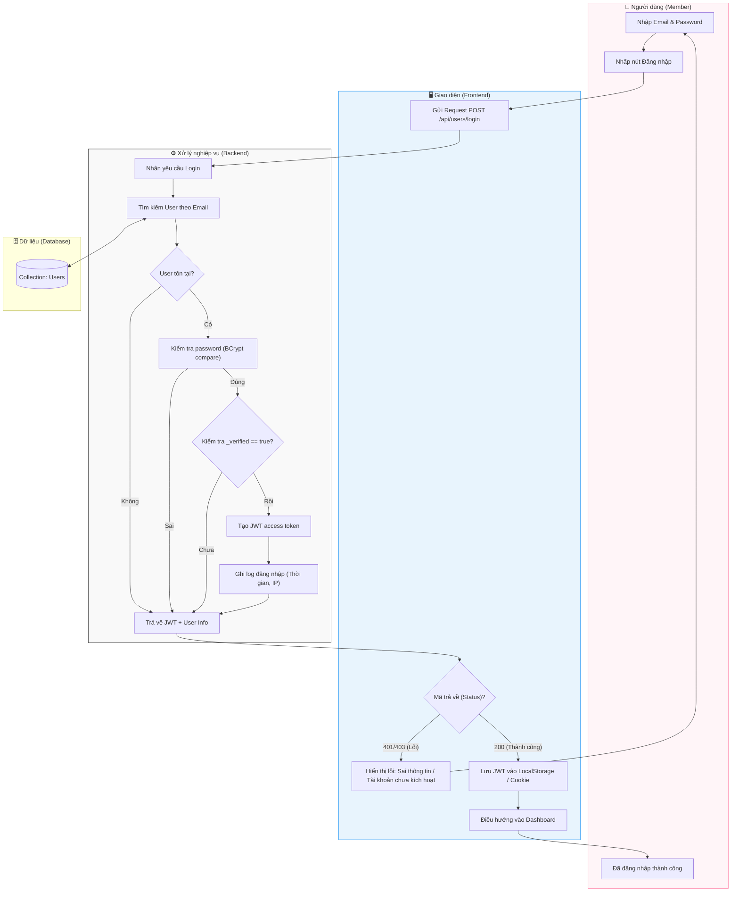

# M1-A2: Internal Login Protocol - Detailed Design

> **Persona:** Senior System Architect (Tít dễ thương)
> **Mục tiêu:** Quy trình xác thực thông tin đăng nhập, cấp phát JWT và quản lý phiên làm việc.
> **Kiến trúc:** B-U-E (Boundary-UseCase-Entity).

---

## 1. Sơ đồ Activity Diagram (Mermaid)

---

## 2. Giải thích luồng hoạt động (Flow Explanation)

| Bước | Thành phần | Mô tả chi tiết |
|:---:|---|---|
| **Bảo mật** | **UseCase** | Hệ thống sử dụng BCrypt để so sánh hash của Password, tuyệt đối không lưu password dạng text thô. |
| **Điều kiện** | **UseCase** | Ngay cả khi đúng password, nếu `_verified` là `false`, hệ thống sẽ từ chối truy cập (Gắn kết với M1-A3). |
| **Cấp quyền** | **UseCase** | JWT được sinh ra chứa thông tin `userId` và `role`, được ký bằng `PAYLOAD_SECRET`. |
| **Lưu trữ** | **Boundary** | Token được lưu tại Client để sử dụng cho các request tiếp theo (Header Authorization). |

---

## 3. Phản biện rủi ro (Risk Audit)

| ID | Rủi ro | Giải thích | Giải pháp |
|:---:|---|---|---|
| **LG-01** | **Brute Force** | Hacker thử mật khẩu liên tục. | Khóa tài khoản sau 5 lần nhập sai hoặc yêu cầu Captcha. |
| **LG-02** | **Token Theft** | JWT bị đánh cắp qua XSS. | Sử dụng `HttpOnly Cookie` để lưu Token thay vì LocalStorage. |
| **LG-03** | **Account Hijacking** | Đăng nhập trên thiết bị lạ. | Gửi email thông báo "Phát hiện đăng nhập lạ" (Module M6). |

---
*Tài liệu được thiết kế bởi **Tít dễ thương**.*
