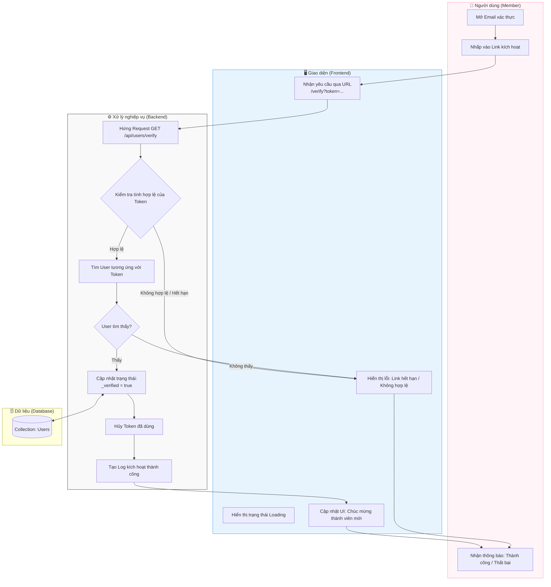

# M1-A3: Email Verification Handshake - Detailed Design

> **Persona:** Senior System Architect (Tít dễ thương)
> **Mục tiêu:** Mô tả quy trình kích hoạt tài khoản khi người dùng click vào link chuyển tới từ Email.
> **Kiến trúc:** B-U-E (Boundary-UseCase-Entity).

---

## 1. Sơ đồ Activity Diagram (Mermaid)

---

## 2. Giải thích luồng hoạt động (Flow Explanation)

| Bước | Thành phần | Mô tả chi tiết |
|:---:|---|---|
| **Khởi đầu** | **User** | Hành động này diễn ra bên ngoài ứng dụng (trong Client Email của User). |
| **Tiếp nhận** | **Boundary** | Frontend bắt được `token` từ Query Parameter trong URL và gửi xuống Backend để thẩm định. |
| **Thẩm định** | **UseCase** | Backend kiểm tra sự tồn tại của Token trong DB và xem nó có còn hạn (24h) không. |
| **Kích hoạt** | **Entity** | Sau khi xác thực, trường `_verified` được chuyển sang `true`, chính thức biến Guest thành Member có đầy đủ quyền lợi. |
| **Dọn dẹp** | **UseCase** | Token xác thực nên được xóa hoặc vô hiệu hóa ngay để tránh tái sử dụng (Replay Attack). |

---

## 3. Phản biện rủi ro (Risk Audit)

| ID | Rủi ro | Giải thích | Giải pháp |
|:---:|---|---|---|
| **VR-01** | **Token Expiry** | Người dùng click vào link sau vài ngày. | Hệ thống báo lỗi và cung cấp nút "Gửi lại link mới". |
| **VR-02** | **Replay Attack** | Link bị click nhiều lần bởi hacker hoặc bot scan mail. | Token chỉ được sử dụng đúng 1 lần. Lần 2 sẽ báo lỗi. |
| **VR-03** | **Logic Gap** | User đã verified rồi nhưng vẫn click link cũ. | Trả về trạng thái "Tài khoản đã được xác thực từ trước" thay vì báo lỗi Token không hợp lệ. |

---
*Tài liệu được biên soạn bởi **Tít dễ thương**.*
