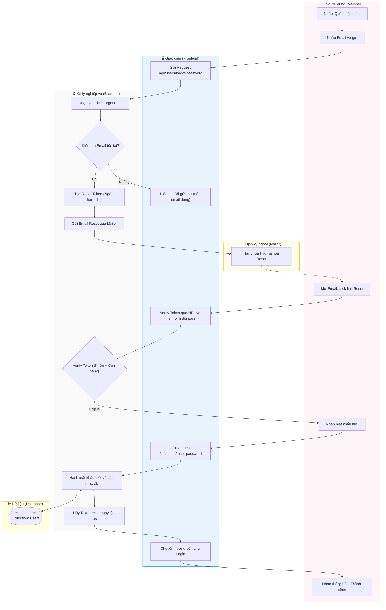

# M1-A4: Password Recovery Cycle - Detailed Design

> **Persona:** Senior System Architect (Tít dễ thương)
> **Mục tiêu:** Quy trình lấy lại quyền truy cập khi người dùng quên mật khẩu thông qua Mailer.
> **Kiến trúc:** B-U-E (Boundary-UseCase-Entity).

---

## 1. Sơ đồ Activity Diagram (Mermaid)

---

## 2. Giải thích luồng hoạt động (Flow Explanation)

| Bước | Thành phần | Mô tả chi tiết |
|:---:|---|---|
| **Yêu cầu** | **User/Boundary** | Chỉ yêu cầu nhập Email. Hệ thống không báo lỗi nếu email chưa tồn tại để bảo mật. |
| **Dịch vụ** | **External** | Email gửi đi phải là dạng HTML chuyên nghiệp và có link rõ ràng. |
| **Xác thực** | **UseCase** | Reset Token có thời hạn rất ngắn (ví dụ: 1 giờ) để giảm cửa sổ rủi ro. |
| **An toàn** | **UseCase** | Sau khi đổi pass thành công, Token phải bị hủy bỏ ngay lập tức để không thể dùng link đó lần thứ 2. |

---

## 3. Phân tích rủi ro (Risk Audit)

| ID | Rủi ro | Giải thích | Giải pháp |
|:---:|---|---|---|
| **RC-01** | **Spam Reset Request** | Kẻ xấu gửi yêu cầu reset hàng loạt vào 1 email của nạn nhân. | Áp dụng "Wait-time" (ví dụ: chỉ được gửi lại sau 5 phút). |
| **RC-02** | **Session Interception** | Link reset bị kẹt lại trong lịch sử trình duyệt hoặc cache. | Token được hủy ngay sau khi dùng. |
| **RC-03** | **Mail Hijacking** | Người dùng bị hack email. | Khuyến khích bật 2FA (giai đoạn sau của dự án). |

---
*Tài liệu được thiết kế bởi **Tít dễ thương**.*
