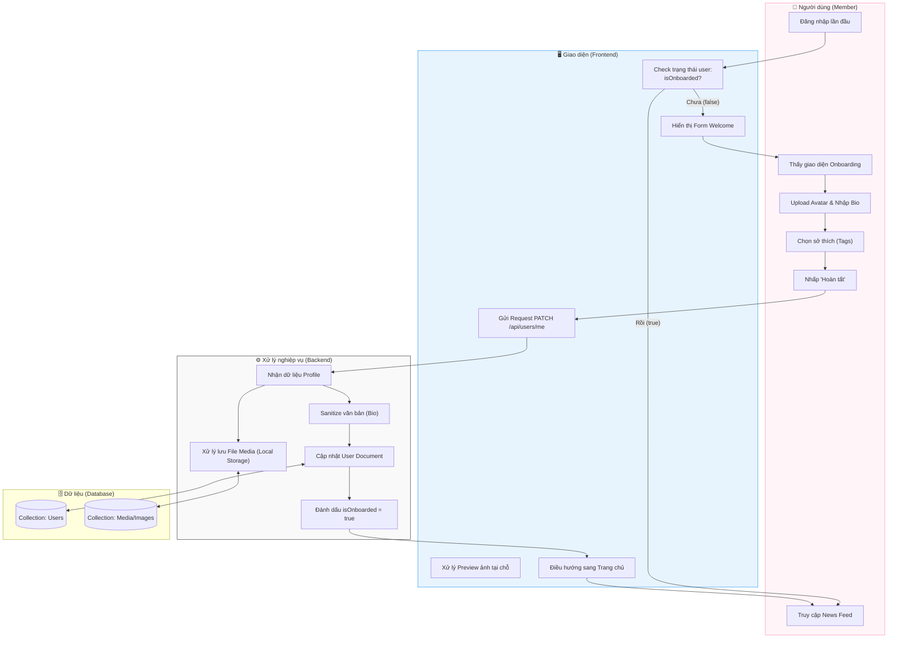

# M1-A5: Profile Onboarding Setup - Detailed Design

> **Persona:** Senior System Architect (Tít dễ thương)
> **Mục tiêu:** Luồng thiết lập thông tin cơ bản ngay sau khi người dùng đăng nhập lần đầu tiên.
> **Kiến trúc:** B-U-E (Boundary-UseCase-Entity).

---

## 1. Sơ đồ Activity Diagram (Mermaid)

---

## 2. Giải thích luồng hoạt động (Flow Explanation)

| Bước | Thành phần | Mô tả chi tiết |
|:---:|---|---|
| **Kích hoạt** | **Boundary** | Ngay sau Login, Frontend kiểm tra một Flag (ví dụ: `isOnboarded`). Nếu chưa, sẽ chặn người dùng vào News Feed cho đến khi xong Profile cơ bản. |
| **Xử lý Ảnh** | **UseCase/Entity** | Ảnh được upload lên server. Tên file được hash và lưu đường dẫn vào database. |
| **Sở thích** | **UseCase** | Việc chọn Tag lúc đầu giúp hệ thống gợi ý nội dung phù hợp ngay từ phiên làm việc đầu tiên (Mô hình Discovery). |
| **Kết thúc** | **UseCase** | Khi Flag `isOnboarded` chuyển sang `true`, người dùng sẽ không bao giờ thấy lại màn hình này nữa. |

---

## 3. Phân tích rủi ro (Risk Audit)

| ID | Rủi ro | Giải thích | Giải pháp |
|:---:|---|---|---|
| **OB-01** | **Bad Content** | Avatar hoặc Bio chứa nội dung nhạy cảm. | Gắn kết với M6 (Moderation) để admin kiểm duyệt sau đó. |
| **OB-02** | **File Bombing** | Upload ảnh dung lượng quá lớn làm treo server. | Frontend & Backend giới hạn dung lượng file (ví dụ: max 2MB). |
| **OB-03** | **UX Friction** | User cảm thấy phiền và muốn bỏ qua. | Thêm nút "Bỏ qua/Thiết lập sau" nếu mục tiêu là giữ chân người dùng thay vì bắt buộc 100%. |

---
*Tài liệu được biên soạn bởi **Tít dễ thương**.*
