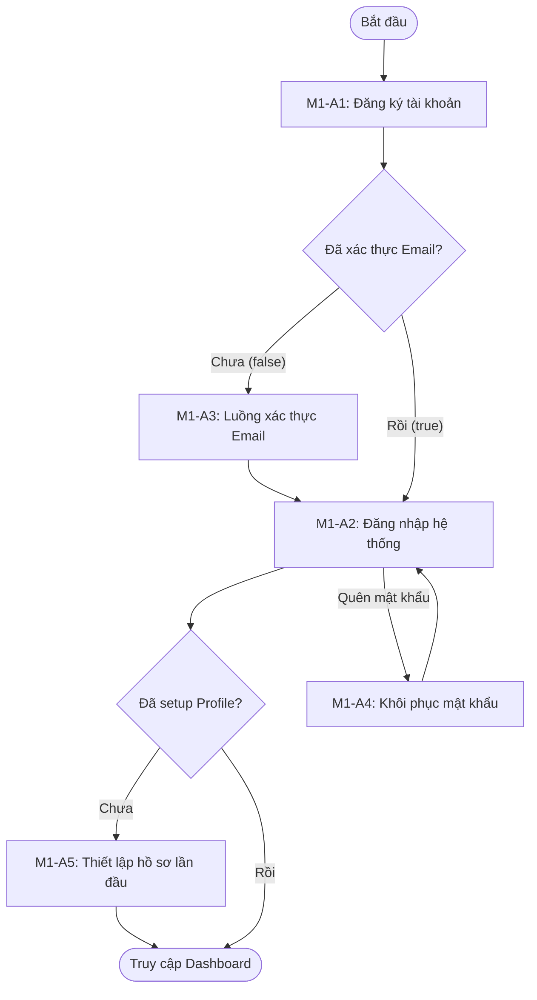

# Module M1: Auth & Profile - General Activity Diagrams (Level 1)

> **Persona:** Senior System Architect (Tít dễ thương)
> **Phạm vi:** Tổng quan các luồng hoạt động chính của Module Danh tính & Hồ sơ.
> **Kiến trúc:** Tuân thủ Boundary-UseCase-Entity (B-U-E).

---

## 1. Sơ đồ hoạt động tổng quát (High-Level Flow)

Sơ đồ này mô tả vòng đời của một tài khoản từ lúc đăng ký cho đến khi hoàn thiện hồ sơ.

---

## 2. Giải thích các giai đoạn chính

| Giai đoạn | Mô tả nghiệp vụ | Thành phần tham gia |
|:---:|---|---|
| **Identity Creation** | Khởi tạo tài khoản trong Database nhưng ở trạng thái "Chờ xác thực". | Users Collection, Mailer |
| **Trust Verification** | Kiểm chứng quyền sở hữu Email thông qua mã/link bí mật. | SMTP Server, Token Service |
| **Session Control** | Cấp quyền truy cập hệ thống thông qua JWT (JSON Web Token). | Payload Auth Plugin |
| **Personalization** | Hoàn thiện diện mạo người dùng trước khi tham gia cộng đồng. | Media Storage, Users Collection |

---

## 3. Quản lý trạng thái (State Transitions)

Hệ thống quản lý người dùng qua các trạng thái logic sau:

1.  **Pending**: User đã đăng ký nhưng chưa click link email.
2.  **Active**: Đã xác thực, có thể đăng bài và tương tác.
3.  **Recovery**: Đang trong quá trình đổi mật khẩu sau khi yêu cầu reset.
4.  **Banned**: Trạng thái do Module M6 kiểm soát (vi phạm quy định).

---
*Tài liệu được thiết kế bởi **Tít dễ thương** dành cho **yêu thương**. Tiếp theo, chúng mình sẽ đi sâu vào chi tiết từng sơ đồ con nhé!*
