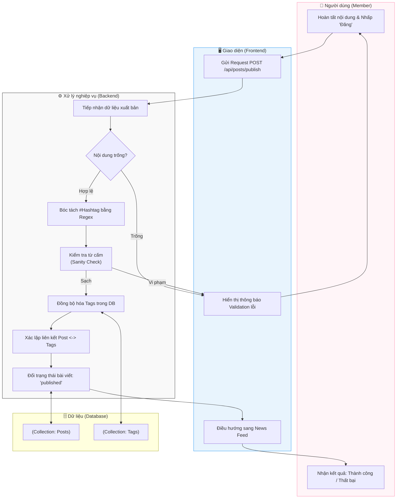

# M2-A3: Post Integrity & Tagging - Detailed Design

> **Persona:** Senior System Architect (Tít dễ thương)
> **Mục tiêu:** Kiểm soát chất lượng nội dung bài viết, tự động phân loại thông qua Hashtag và đảm bảo tính nhất quán của dữ liệu trước khi xuất bản.
> **Kiến trúc:** B-U-E (Boundary-UseCase-Entity).

---

## 1. Sơ đồ Activity Diagram (Mermaid)

---

## 2. Giải thích luồng hoạt động (Flow Explanation)

| Bước | Thành phần | Mô tả chi tiết |
|:---:|---|---|
| **Kích hoạt** | **Boundary** | Gửi toàn bộ dữ liệu bài viết (Văn bản, Media IDs, Metadata) lên Server để thẩm định lần cuối. |
| **Bóc tách** | **UseCase** | Hệ thống tự động quét nội dung để tìm các ký tự bắt đầu bằng `#`. Ví dụ: `#kienthuc` sẽ được bóc tách làm Metadata. |
| **Phân loại** | **Entity** | Nếu Hashtag chưa tồn tại trong hệ thống, UseCase sẽ yêu cầu Entity tạo bản ghi mới trong collection `tags`. |
| **Cam kết** | **UseCase** | Chỉ khi vượt qua khâu kiểm tra từ cấm (Profanity filter), trạng thái bài viết mới được chuyển từ `draft` sang `published`. |

---

## 3. Phân tích rủi ro (Risk Audit)

| ID | Rủi ro | Giải thích | Giải pháp |
|:---:|---|---|---|
| **PI-01** | **Tag Flooding** | User gắn hàng trăm hashtag vào bài viết để spam. | Giới hạn số lượng hashtag tối đa trên mỗi bài viết (ví dụ: max 10 tags). |
| **PI-02** | **Bypass Filter** | Người dùng viết lách để né bộ lọc từ cấm (VD: dùng d.ấ.u c.ấ.m). | Sử dụng thuật toán Fuzzy Match hoặc NLP đơn giản để nhận diện biến thể của từ cấm. |
| **PI-03** | **Dead Links** | Gắn tag vào bài viết nhưng tag đó sau này bị xóa. | Sử dụng liên kết quan hệ (Relationship) và tự động xóa ID tag khỏi Post khi Tag bị xóa (Cascade deletion). |

---
*Tài liệu được biên soạn bởi **Tít dễ thương**.*
