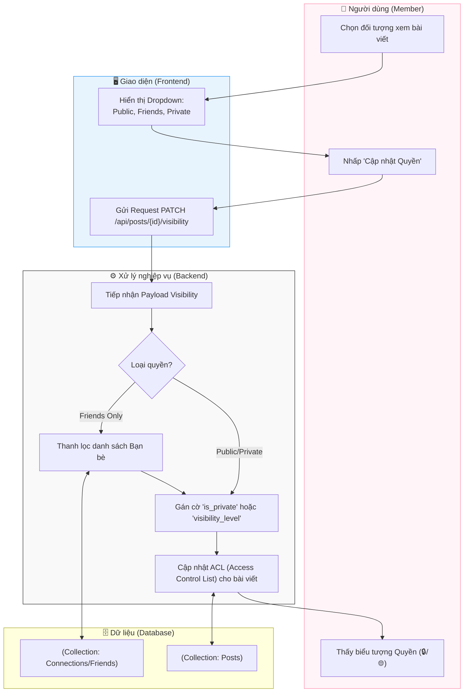

# M2-A4: Visibility Enforcement - Detailed Design

> **Persona:** Senior System Architect (Tít dễ thương)
> **Mục tiêu:** Quản lý quyền riêng tư của bài viết, đảm bảo chỉ những đối tượng được phép mới có thể tiếp cận nội dung.
> **Kiến trúc:** B-U-E (Boundary-UseCase-Entity).

---

## 1. Sơ đồ Activity Diagram (Mermaid)

---

## 2. Giải thích luồng hoạt động (Flow Explanation)

| Bước | Thành phần | Mô tả chi tiết |
|:---:|---|---|
| **Lựa chọn** | **User** | Người dùng quyết định phạm vi lan tỏa của kiến thức. |
| **Phân loại** | **UseCase** | Có 3 mức cơ bản: **Public** (Ai cũng thấy), **Friends** (Chỉ bạn bè thấy), **Private** (Chỉ mình tôi). |
| **Kiểm tra chéo** | **UseCase** | Với tùy chọn 'Friends', hệ thống phải truy vấn collection `connections` để xác định danh sách UID hợp lệ. |
| **Thực thi** | **Entity** | Khi một người dùng khác truy vấn News Feed, DB sẽ thực hiện Filter dựa trên thuộc tính này (Gắn kết với M3). |

---

## 3. Phân tích rủi ro (Risk Audit)

| ID | Rủi ro | Giải thích | Giải pháp |
|:---:|---|---|---|
| **VE-01** | **Privacy Leak** | Bài viết 'Private' nhưng vẫn hiện trong kết quả tìm kiếm (Search). | Tích hợp Check Visibility vào pipeline Search và Indexing. |
| **VE-02** | **Relationship Latency** | Hủy kết bạn nhưng vẫn thấy bài viết 'Friends Only' do cache. | Invalidate cache ngay khi có sự thay đổi trong trạng thái quan hệ (Connection change). |
| **VE-03** | **Unintended Access** | Truy cập trực tiếp qua Direct Link của bài viết Private. | UseCase kiểm tra quyền sở hữu và quan hệ ngay tại layer Fetching bằng Middleware. |

---
*Tài liệu được biên soạn bởi **Tít dễ thương**.*
