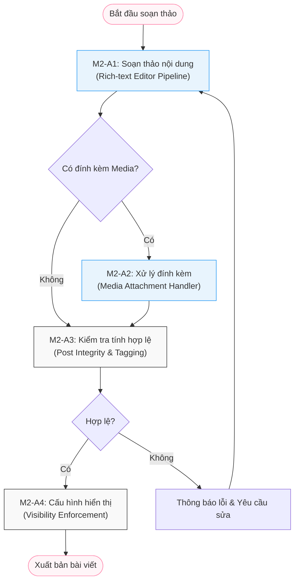

# Module M2: Content Engine - General Activity Diagrams (Level 1)

> **Persona:** Senior System Architect (Tít dễ thương)
> **Phạm vi:** Mô tả vòng đời của nôi dung (Post) từ lúc khởi tạo đến khi xuất bản.
> **Kiến trúc:** Tuân thủ Boundary-UseCase-Entity (B-U-E).

---

## 1. Sơ đồ hoạt động tổng quát (High-Level Flow)

Sơ đồ này mô tả cách một "ý tưởng" của người dùng trở thành một bài viết hoàn chỉnh trên hệ thống.

---

## 2. Giải thích các giai đoạn chính (Stages Explanation)

| Giai đoạn | Vai trò | Trách nhiệm chính |
|:---:|---|---|
| **Composition** | `M2-A1` | Cung cấp giao diện soạn thảo (Lexical/TipTap), xử lý định dạng văn bản nâng cao. |
| **Materialization** | `M2-A2` | Tiếp nhận file (ảnh/video), nén, tối ưu hóa và trả về định danh (ID) để gắn vào bài viết. |
| **Integrity Audit** | `M2-A3` | Phân tích nội dung để bóc tách Hashtag, kiểm tra spam hoặc từ cấm (Sanity check). |
| **Access Policy** | `M2-A4` | Xác định ai có thể xem bài viết (Công khai, Bạn bè, hoặc Chỉ mình tôi). |

---

## 3. Trạng thái của nội dung (Content Lifecycle States)

1.  **Draft**: Bài viết đang soạn thảo, chỉ lưu tạm ở Client hoặc LocalStorage.
2.  **Pending**: Đã gửi lên Server nhưng đang chờ xử lý đính kèm hoặc kiểm duyệt tự động.
3.  **Published**: Đã xuất bản thành công, hiển thị trên News Feed.
4.  **Archived**: Bài viết đã bị ẩn hoặc gỡ bỏ (nhưng vẫn còn trong database để log).

---
*Tài liệu được thiết kế bởi **Tít dễ thương** dành cho **yêu thương**. Chúng mình sẽ bắt đầu đi vào chi tiết từng sơ đồ con nhé!*
