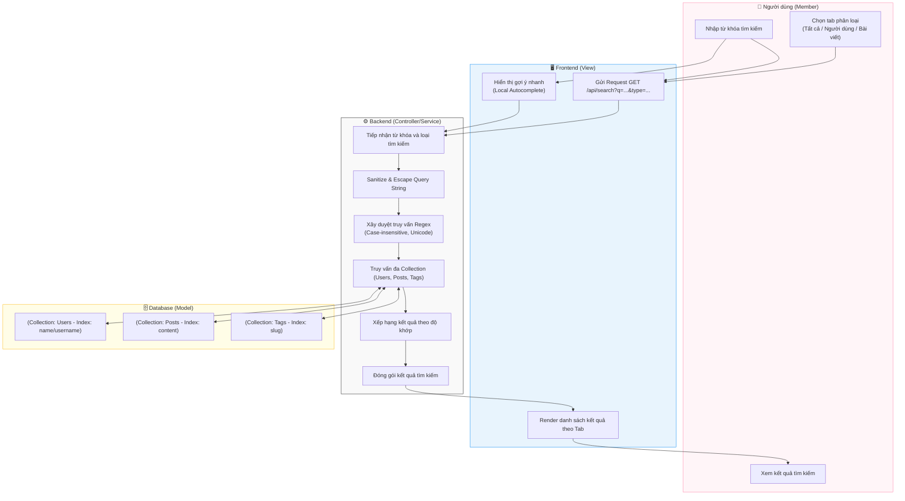

# M3-A2: Search Engine Query - Detailed Design

> **Persona:** Senior System Architect (Tít dễ thương)
> **Mục tiêu:** Mô tả luồng tìm kiếm đa mục tiêu (Post, User, Tag) sử dụng sức mạnh nội tại của Database (Local Search).
> **Kiến trúc:** **MVC** (View - Controller/Service - Model).

---

## 1. Sơ đồ Activity Diagram (Mermaid)

---

## 2. Giải thích luồng hoạt động (Flow Explanation)

| Bước | Thành phần | Mô tả chi tiết |
|:---:|---|---|
| **Autocomplete** | **View** | Frontend chủ động kích hoạt API tìm kiếm khi người dùng bắt đầu gõ để tăng tính tương tác. |
| **Tìm kiếm Nội tại** | **Controller/Service** | Thay vì Atlas Search, hệ thống sử dụng **Regex** kết hợp với **Case-insensitive** để tìm kiếm linh hoạt trên các trường văn bản. |
| **Phân loại** | **Controller/Service** | Logic Backend tự động phân luồng truy vấn vào đúng các Collections (Users, Posts, Tags) dựa trên tham số `type`. |
| **Tối ưu hóa** | **Model** | Đảm bảo các trường tiêu đề và tên người dùng được **Indexing** để luồng Regex không gây nặng tải cho Database. |

---

## 3. Phân tích rủi ro (Risk Audit)

| ID | Rủi ro | Giải thích | Giải pháp |
|:---:|---|---|---|
| **SE-01** | **Query Injection** | Người dùng nhập các ký tự Regex đặc biệt để phá hoại câu query. | Backend thực hiện **Escape** (thoát chuỗi) tất cả các ký tự đặc biệt trước khi đưa vào Regex engine. |
| **SE-02** | **Privacy Breach** | Tìm bài viết riêng tư hoặc của người dùng bị cấm. | Model luôn lồng điều kiện lọc `status: 'active'` và `visibility: 'public'` vào mọi câu truy vấn. |
| **SE-03** | **Regex Performance** | Câu truy vấn Regex quá phức tạp gây tốn tài nguyên CPU. | Giới hạn độ dài từ khóa tìm kiếm (min 3 ký tự) và sử dụng `$and` để giảm bớt tập dữ liệu trước khi chạy Regex. |

---
*Tài liệu được cập nhật bởi **Tít dễ thương** - Tiếp cận **MVC & Local-First**.*
