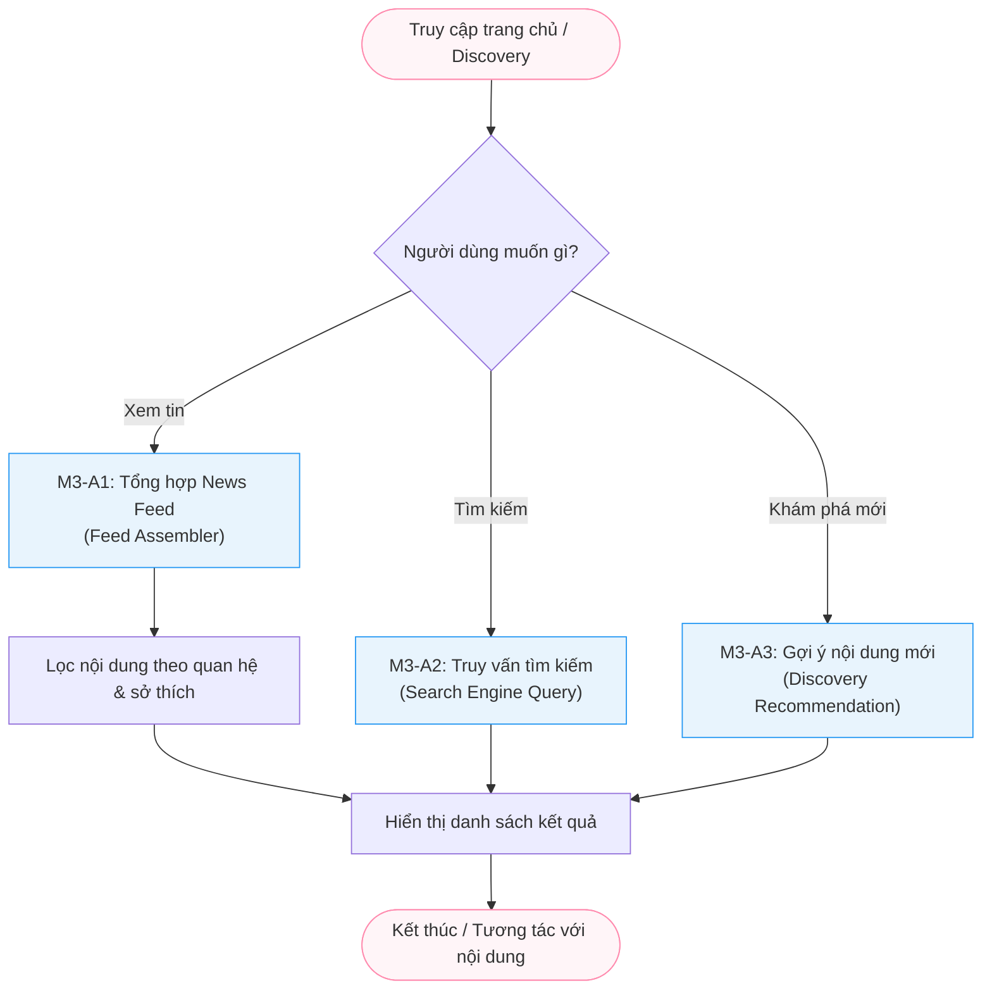

# Module M3: Discovery & Feed - General Activity Diagrams (Level 1)

> **Persona:** Senior System Architect (Tít dễ thương)
> **Phạm vi:** Mô tả cách hệ thống phân phối nội dung và hỗ trợ người dùng khám phá (Search/Discovery).
> **Kiến trúc:** Tuân thủ Boundary-UseCase-Entity (B-U-E).

---

## 1. Sơ đồ hoạt động tổng quát (High-Level Flow)

Sơ đồ này mô tả hai luồng chính: Nhận tin (Feed) và Tìm kiếm (Discovery).

---

## 2. Giải thích các giai đoạn chính (Stages Explanation)

| Giai đoạn | Vai trò | Trách nhiệm chính |
|:---:|---|---|
| **Feed Assembly** | `M3-A1` | Thu thập bài viết từ những người User đang theo dõi và các bài viết công khai có liên quan. |
| **Search Engine** | `M3-A2` | Sử dụng Atlas Search (Fuzzy search) để tìm kiếm Post, User hoặc Tag theo từ khóa. |
| **Recommendation** | `M3-A3` | Đề xuất những nội dung đang "Trending" hoặc phù hợp với sở thích trong Profile của người dùng. |

---

---

## 3. Thành phần Hạ tầng (Local Technical Stack)

Dựa trên kiến trúc **MVC**, hệ thống ưu tiên sử dụng tài nguyên nội tại (Local) để giải quyết các bài toán kỹ thuật:

1.  **Local Search Logic (Regex/Query)**: Sử dụng sức mạnh truy vấn của MongoDB và Regex để tìm kiếm nội dung, không phụ thuộc vào dịch vụ bên thứ 3.
2.  **Local Image Processor (Sharp)**: Tận dụng thư viện xử lý ảnh tại Backend để tạo thumbnail và nén ảnh ngay khi upload, lưu trữ trực tiếp trên Local Storage.
3.  **Local Database Indexing**: Tối ưu hóa hiệu năng bằng các bộ Index (Single/Compound) được thiết lập trực tiếp trong các Collection.

---
*Tài liệu được cập nhật dựa trên tiếp cận **MVC & Local-First** theo yêu cầu của yêu thương.*
