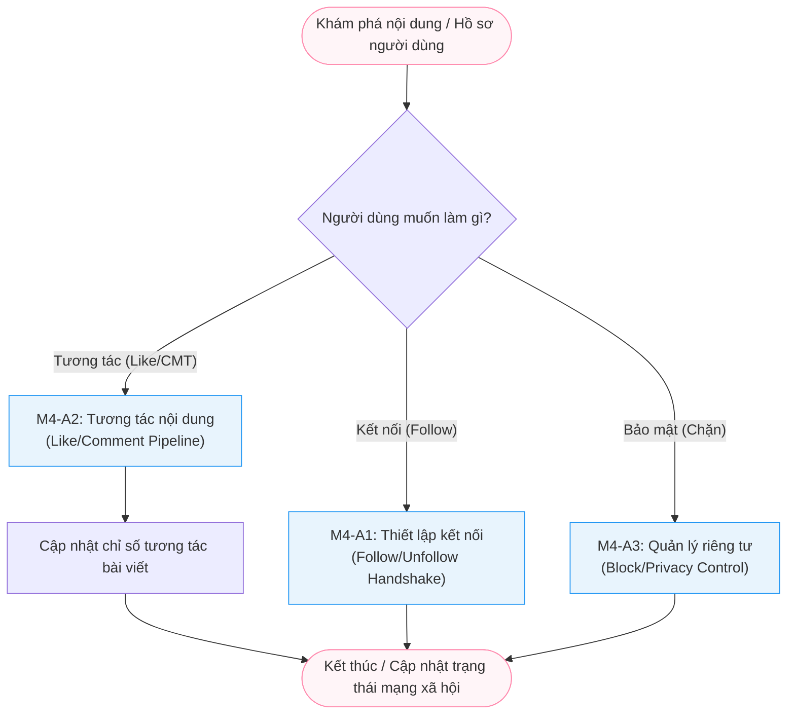

# Module M4: Engagement & Connections - General Activity Diagrams (Level 1)

> **Persona:** Senior System Architect (Tít dễ thương)
> **Phạm vi:** Mô tả cách người dùng tương tác với nội dung và kết nối với nhau trong mạng xã hội.
> **Kiến trúc:** **MVC** (View - Controller/Service - Model) & **Local-First**.

---

## 1. Sơ đồ hoạt động tổng quát (High-Level Flow)

Sơ đồ này mô tả hai luồng chính: Tương tác nội dung và Quản lý quan hệ.

---

## 2. Giải thích các giai đoạn chính (Stages Explanation)

| Giai đoạn | Vai trò | Trách nhiệm chính |
|:---:|---|---|
| **Handshake** | `M4-A1` | Quản lý luồng theo dõi (Follow). Sử dụng Model cục bộ để kiểm tra sự tồn tại của quan hệ trước khi cập nhật. |
| **Engagement** | `M4-A2` | Xử lý Like và Bình luận. Đảm bảo tính nhất quán giữa nội dung bình luận và bài viết gốc mà không thông qua dịch vụ ngoài. |
| **Enforcement** | `M4-A3` | Thực thi các rào cản kết nối (Chặn/Bỏ chặn). Đây là bộ lọc an toàn cho trải nghiệm người dùng. |

---

## 3. Thành phần Hạ tầng (Local Technical Stack)

Hệ thống tuân thủ triết lý **MVC** và xử lý **Local** hoàn toàn:

1.  **Local Notification Trigger**: Khi có tương tác, Controller chủ động gọi Service thông báo để cập nhật cho người dùng (Internal Service Call).
2.  **Model Relationships**: Sử dụng các bản ghi (Documents) trong collection `connections` để lưu trữ quan hệ, tránh dùng đồ thị bên ngoài (Graph DB).
3.  **Local Verification**: Mọi hành động tương tác đều được Model kiểm tra quyền (Access Control) ngay tại chỗ dựa trên trạng thái `isPrivate` hoặc `Blocked`.

---
*Tài liệu được cập nhật theo tiếp cận **MVC & Local-First** bởi **Tít dễ thương**.*
