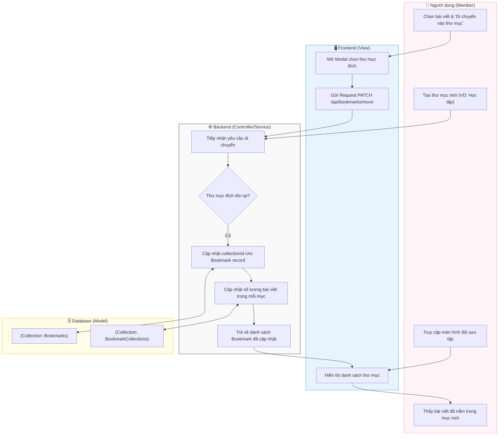

# M5-A2: Collection Orchestrator - Detailed Design

> **Persona:** Senior System Architect (Tít dễ thương)
> **Mục tiêu:** Mô tả luồng quản lý và phân loại bài viết vào các bộ sưu tập (Collections) tùy chỉnh.
> **Kiến trúc:** **MVC** (View - Controller/Service - Model).

---

## 1. Sơ đồ Activity Diagram (Mermaid)

---

## 2. Giải thích luồng hoạt động (Flow Explanation)

| Bước | Thành phần | Mô tả chi tiết |
|:---:|---|---|
| **Khởi tạo** | **User** | Người dùng có thể cá nhân hóa kho tri thức bằng cách tạo ra các thư mục có tên riêng. |
| **Phân loại** | **View** | Cung cấp giao diện kéo-thả (Drag & Drop) hoặc menu "Di chuyển" để thay đổi thư mục đích cho bài viết đã lưu. |
| **Gắn kết lại** | **Controller/Service** | Thay vì xóa và tạo mới, hệ thống chỉ cập nhật trường `collectionId` của bản ghi Bookmark hiện tại để giữ nguyên metadata. |
| **Thư mục hệ thống** | **Model** | Thư mục "Tất cả" là thư mục hệ thống không thể xóa, đóng vai trò là nơi lưu trữ mặc định. |

---

## 3. Phân tích rủi ro (Risk Audit)

| ID | Rủi ro | Giải thích | Giải pháp |
|:---:|---|---|---|
| **CO-01** | **Collection Deletion** | Xóa bộ sưu tập đang chứa hàng trăm bài viết. | **Controller** sẽ gán lại toàn bộ bài viết trong thư mục bị xóa về lại thư mục "Tất cả" (Default) thay vì xóa hẳn bookmark. |
| **CO-02** | **Duplicate Name** | Tạo nhiều thư mục trùng tên. | Sử dụng logic kiểm tra `slug` hoặc tên duy nhất cho mỗi `userId` trong Model. |
| **CO-03** | **Unauthorized Move** | Di chuyển bài viết vào một thư mục không thuộc sở hữu của mình. | Controller bắt buộc kiểm tra `ownerId` của `collectionId` trước khi thực hiện cập nhật. |

---
*Tài liệu được cập nhật dựa trên tiếp cận **MVC & Local-First** bởi **Tít dễ thương**.*
