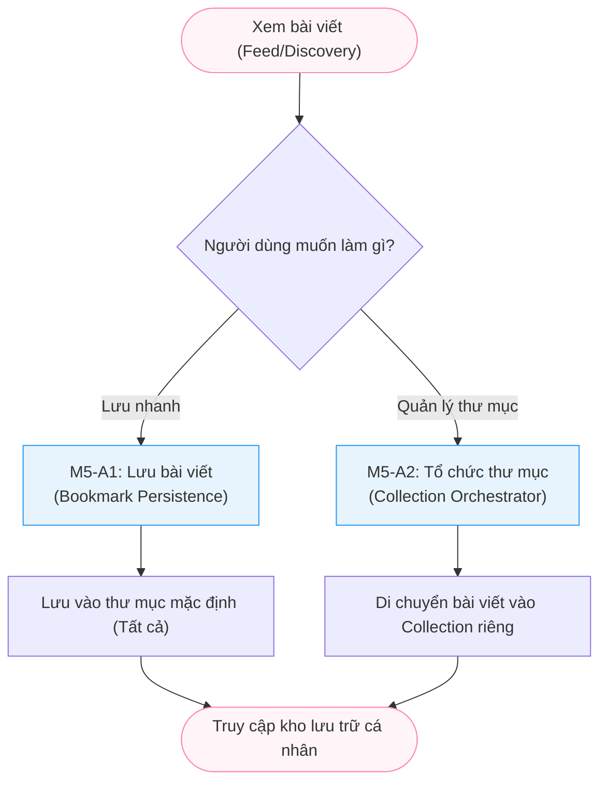

# Module M5: Bookmarking - General Activity Diagrams (Level 1)

> **Persona:** Senior System Architect (Tít dễ thương)
> **Phạm vi:** Quản lý việc lưu trữ và tổ chức các bài viết yêu thích (Knowledge Management).
> **Kiến trúc:** **MVC** (View - Controller/Service - Model) & **Local-First**.

---

## 1. Sơ đồ hoạt động tổng quát (High-Level Flow)

Sơ đồ này mô tả cách người dùng lưu trữ nội dung và sắp xếp chúng vào các thư mục cá nhân.

---

## 2. Giải thích các giai đoạn chính (Stages Explanation)

| Giai đoạn | Vai trò | Trách nhiệm chính |
|:---:|---|---|
| **Persistence** | `M5-A1` | Xử lý việc bật/tắt (Toggle) trạng thái lưu của bài viết. Mặc định mọi bài viết lưu sẽ nằm trong folder "Tất cả". |
| **Orchestration** | `M5-A2` | Cho phép người dùng tạo, sửa, xóa các bộ sưu tập (Collections) và phân loại bài viết đã lưu vào đó. |

---

## 3. Thành phần Hạ tầng (Local Technical Stack)

Hệ thống tuân thủ triết lý **MVC** và xử lý **Local** hoàn toàn:

1.  **Local Storage Reference**: Khi người dùng xem bài viết, View kiểm tra xem bài viết đã được Bookmark chưa thông qua một bản đồ ID cục bộ để hiển thị icon 🔖 chính xác.
2.  **Model Mapping**: Sử dụng collection `bookmarks` để lưu liên kết giữa `userId`, `postId` và `collectionId`. Không cần hệ thống quản lý file bên ngoài.
3.  **Atomic Updates**: Cập nhật số lượng bài viết trong mỗi bộ sưu tập bằng các toán tử nguyên tử của MongoDB để đảm bảo tính chính xác khi người dùng thao tác nhanh.

---
*Tài liệu được thiết kế theo tiếp cận **MVC & Local-First** bởi **Tít dễ thương**.*
