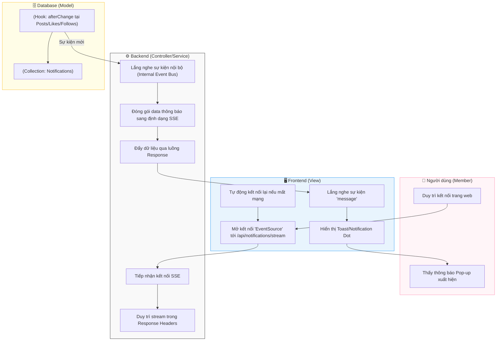

# M6-A1: SSE Event Dispatcher - Detailed Design

> **Persona:** Senior System Architect (Tít dễ thương)
> **Mục tiêu:** Mô tả luồng đẩy thông báo thời gian thực từ Server xuống Client sử dụng công nghệ Server-Sent Events (SSE).
> **Kiến trúc:** **MVC** (View - Controller/Service - Model).

---

## 1. Sơ đồ Activity Diagram (Mermaid)

---

## 2. Giải thích luồng hoạt động (Flow Explanation)

| Bước | Thành phần | Mô tả chi tiết |
|:---:|---|---|
| **Duy trì kết nối** | **View** | Trình duyệt mở một kênh HTTP dài (Long-lived) tới Server. SSE hiệu quả hơn WebSocket cho các ứng dụng chỉ cần luồng dữ liệu một chiều (Server -> Client). |
| **Kích hoạt ngầm** | **Model** | Khi có bất kỳ thay đổi nào (Like, Comment, Follow), các Hook `afterChange` của Database sẽ phát đi tín hiệu sự kiện. |
| **Điều phối** | **Controller/Service** | Service lọc sự kiện theo `userId`, đảm bảo chỉ đẩy thông báo của ai tới đúng trình duyệt của người đó. |
| **Persistence** | **Model** | Thông báo cũng được lưu vào collection `notifications` để người dùng có thể xem lại trong tương lai khi không online. |

---

## 3. Phân tích rủi ro (Risk Audit)

| ID | Rủi ro | Giải thích | Giải pháp |
|:---:|---|---|---|
| **ED-01** | **Connection Leak** | Quá nhiều kết nối SSE treo gây cạn kiệt tài nguyên Server. | Controller thiết lập **Timeout** và cơ chế dọn dẹp kết nối (Cleanup) khi User đóng tab hoặc logout. |
| **ED-02** | **Message Loss** | Mất kết nối lúc Server đang đẩy tin, thông báo bị trôi mất. | Client sẽ tự động lấy lại (Refetch) danh sách thông báo chưa đọc từ Database ngay sau khi kết nối lại thành công. |
| **ED-03** | **Scalability** | Khi có hàng ngàn User online, memory của Controller sẽ quá tải. | Sử dụng **Redis Pub/Sub** (Phát triển sau) hoặc giới hạn số lượng kết nối đồng thời trên mỗi Instance chạy ứng dụng. |

---
*Tài liệu được cập nhật dựa trên tiếp cận **MVC & Local-First** bởi **Tít dễ thương**.*
