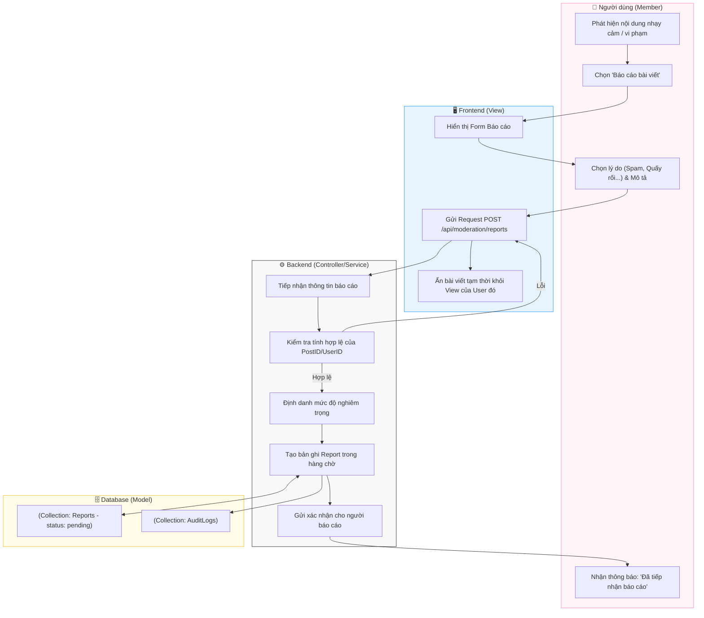

# M6-A2: Content Report Pipeline - Detailed Design

> **Persona:** Senior System Architect (Tít dễ thương)
> **Mục tiêu:** Mô tả luồng tiếp nhận báo cáo từ người dùng về các nội dung vi phạm, đảm bảo quy trình xử lý minh bạch và công bằng.
> **Kiến trúc:** **MVC** (View - Controller/Service - Model).

---

## 1. Sơ đồ Activity Diagram (Mermaid)

---

## 2. Giải thích luồng hoạt động (Flow Explanation)

| Bước | Thành phần | Mô tả chi tiết |
|:---:|---|---|
| **Lọc nhanh** | **View** | Ngay khi báo cáo thành công, Frontend chủ động ẩn bài viết đó đi (Local hide) để bảo vệ trải nghiệm của người dùng ngay lập tức. |
| **Phân loại** | **Controller/Service** | Backend không chỉ lưu báo cáo mà còn phải phân loại mức độ ưu tiên dựa trên lý do (Ví dụ: 'Nội dung nguy hiểm' sẽ có mức ưu tiên cao hơn 'Spam'). |
| **Hàng chờ** | **Model** | Báo cáo được lưu vào collection `reports` với trạng thái ban đầu là `pending`, chờ Admin vào xử lý ở Phase M6-A3. |
| **Vết tích** | **Model** | Mọi báo cáo đều được ghi lại trong `AuditLogs` để tránh tình trạng Admin hoặc User xóa dấu vết báo cáo. |

---

## 3. Phân tích rủi ro (Risk Audit)

| ID | Rủi ro | Giải thích | Giải pháp |
|:---:|---|---|---|
| **RP-01** | **Mass Reporting** | Một nhóm người dùng cùng lúc báo cáo 1 bài viết để tìm cách gỡ bài đó. | Controller kiểm tra số lượng báo cáo từ cùng một dải IP hoặc cùng một nhóm User trong thời gian ngắn để cảnh báo sự tấn công. |
| **RP-02** | **Reporting Spam** | User gửi hàng loạt báo cáo vô căn cứ để gây nhiễu Admin. | Áp dụng giới hạn số lượng báo cáo (Quota) trên mỗi tài khoản trong ngày. Tài khoản báo cáo sai nhiều lần sẽ bị giảm độ tin cậy. |
| **RP-03** | **Deleted Target** | Nội dung bị báo cáo bị User xóa trước khi Admin kịp xem. | Backend sẽ lưu lại một bản Snapshot (chụp lại nội dung) tại thời điểm báo cáo để phục vụ công tác đối soát sau này. |

---
*Tài liệu được cập nhật dựa trên tiếp cận **MVC & Local-First** bởi **Tít dễ thương**.*
