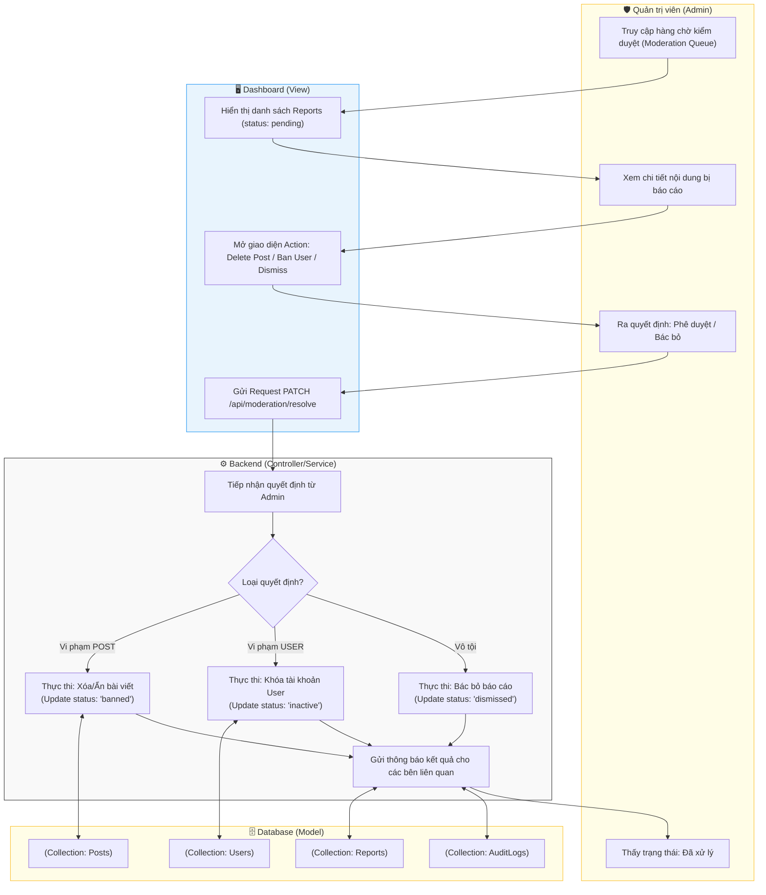

# M6-A3: Enforcement Action - Detailed Design

> **Persona:** Senior System Architect (Tít dễ thương)
> **Mục tiêu:** Mô tả luồng xử lý và thực thi quyết định kiểm duyệt từ phía Quản trị viên (Admin), bảo vệ sự trong sạch của cộng đồng.
> **Kiến trúc:** **MVC** (View - Controller/Service - Model).

---

## 1. Sơ đồ Activity Diagram (Mermaid)

---

## 2. Giải thích luồng hoạt động (Flow Explanation)

| Bước | Thành phần | Mô tả chi tiết |
|:---:|---|---|
| **Công tâm** | **Admin** | Admin có cái nhìn khách quan về báo cáo, có thể đối soát nội dung gốc (Snapshot) và lý do báo cáo. |
| **Phân vùng** | **Controller/Service** | Tùy mức độ vi phạm, hệ thống hỗ trợ 3 mức xử lý: Nhắc nhở (Dismiss), Xử lý nội dung (Ban Post) hoặc Xử lý chủ thể (Ban User). |
| **Xác lập quyền** | **Controller/Service** | Kiểm duyệt là hành động nhạy cảm, chỉ những User có Role `Admin` mới được phép truy cập vào Controller này. |
| **Lưu vết** | **Model** | Mọi quyết định kiểm duyệt bắt buộc phải ghi lại `adminId`, `reason` và `timestamp` vào `AuditLogs` để quản lý cấp cao có thể kiểm tra chéo (Auditing). |

---

## 3. Phân tích rủi ro (Risk Audit)

| ID | Rủi ro | Giải thích | Giải pháp |
|:---:|---|---|---|
| **EA-01** | **Abuse of Power** | Admin lạm quyền để xóa bài hoặc khóa tài khoản cá nhân. | Mọi quyết định đều được lưu log không thể xóa. Hệ thống cần cơ chế Reviewer cho các quyết định khóa vĩnh viễn tài khoản. |
| **EA-02** | **Accidental Deletion** | Admin bấm nhầm nút xóa bài. | Sử dụng **Soft Delete** (Chỉ đổi status, không xóa database ngay lập tức) để có thể khôi phục trong vòng 30 ngày. |
| **EA-03** | **Retaliation** | Người bị khóa tài khoản tìm cách trả đũa hệ thống. | Khi khóa tài khoản, hệ thống tự động đăng xuất User khỏi mọi thiết bị và vô hiệu hóa Token ngay lập tức. |

---
*Tài liệu được cập nhật dựa trên tiếp cận **MVC & Local-First** bởi **Tít dễ thương**.*
