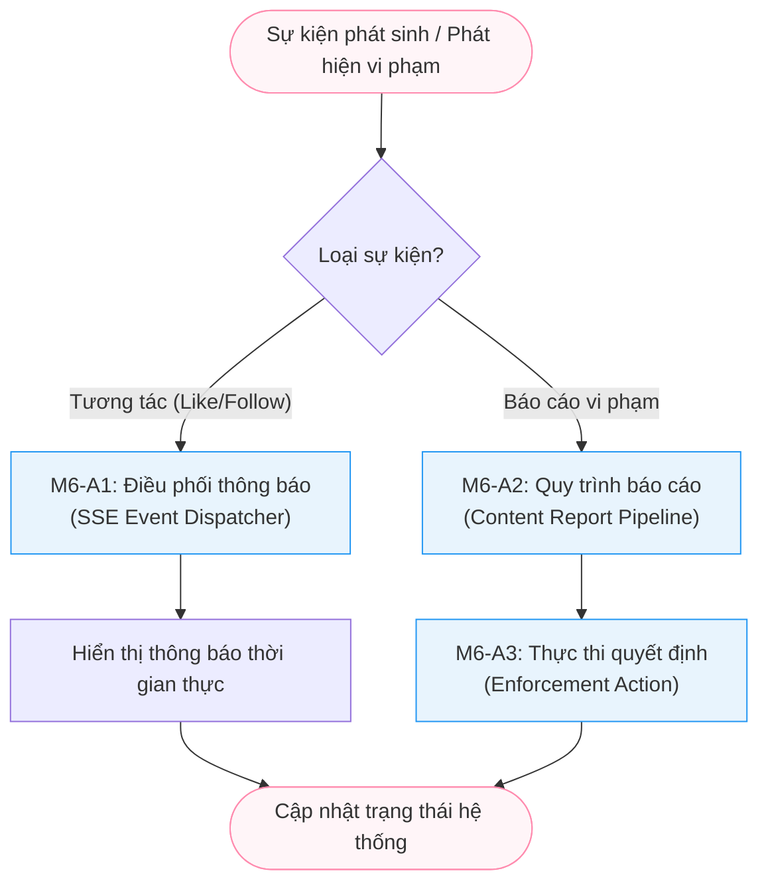

# Module M6: Notifications & Moderation - General Activity Diagrams (Level 1)

> **Persona:** Senior System Architect (Tít dễ thương)
> **Phạm vi:** Quản lý hệ thống thông báo thời gian thực và quy trình kiểm duyệt nội dung an toàn.
> **Kiến trúc:** **MVC** (View - Controller/Service - Model) & **Local-First**.

---

## 1. Sơ đồ hoạt động tổng quát (High-Level Flow)

Sơ đồ này mô tả hai trụ cột của Module M6: Luồng phản hồi tương tác (Notification) và Luồng bảo vệ cộng đồng (Moderation).

---

## 2. Giải thích các giai đoạn chính (Stages Explanation)

| Giai đoạn | Vai trò | Trách nhiệm chính |
|:---:|---|---|
| **Real-time Event** | `M6-A1` | Lắng nghe các thay đổi trong Database (Internal Events) và đẩy thông báo xuống Client thông qua luồng SSE gửi đi. |
| **Audit Filing** | `M6-A2` | Quy trình tiếp nhận khiếu nại từ người dùng, gắn thẻ loại vi phạm và đưa vào hàng chờ (Queue) kiểm duyệt. |
| **Resolution** | `M6-A3` | Phân vùng dành cho Admin để đưa ra quyết định: Bỏ qua, Cảnh cáo, Gỡ bài hoặc Khóa tài khoản. |

---

## 3. Thành phần Hạ tầng (Local Technical Stack)

Module M6 tuân thủ triết lý **MVC** & **Local-First** bằng cách không sử dụng Firebase hay Push Service bên thứ 3:

1.  **Local SSE (Server-Sent Events)**: Sử dụng luồng dữ liệu một chiều từ Server tới Client qua kết nối HTTP duy trì, không cần Socket.io hay Cloud Messaging.
2.  **Internal Event Bus**: Sử dụng EventEmitter hoặc Hook trực tiếp của PayloadCMS để kích hoạt thông báo ngay sau khi Model thay đổi.
3.  **Local Enforcement**: Các hành động khóa/xóa được thực hiện trực tiếp trên Model cục bộ và lưu vết vào `audits` collection để đảm bảo tính minh bạch.

---
*Tài liệu được thiết kế theo tiếp cận **MVC & Local-First** bởi **Tít dễ thương**.*
