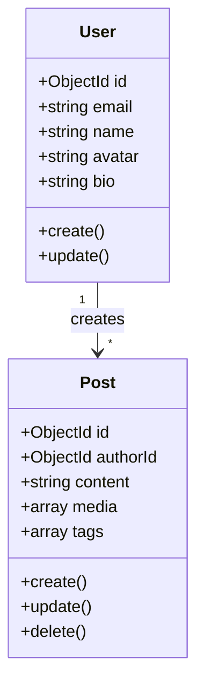

# Class Diagram

> **Mục đích:** Cấu trúc OOP (nếu cần)  
> **Format:** Mermaid classDiagram  
> **Ghi chú:** Optional - Payload CMS dùng Collections, có thể bỏ qua hoặc map sang interface/types  

---

