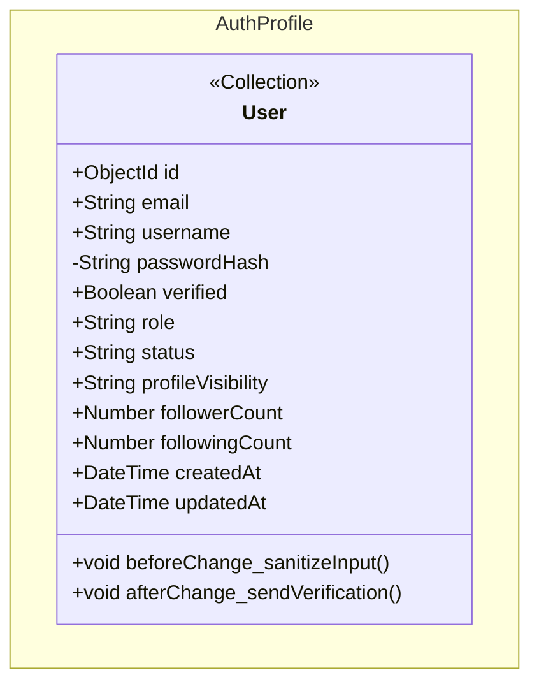

# class-m1 — Auth & Profile Class Diagram

> **Module**: M1 — Auth & Profile
> **Generated by**: Skill 2.5 (class-diagram-analyst)
> **Date**: 2026-02-20
> **Status**: ✅ Approved (IP2)
> **Source**: `Docs/life-2/diagrams/er-diagram.md` + `activity-diagrams/m1-a*.md` + `UseCase/use-case-m1-auth-profile.md`

---

## Class Diagram (Mermaid)

> **Chú ý**:
> - `passwordHash` dùng visibility `-` (private) — không được expose qua API
> - `role`: enum `member | admin`
> - `status`: enum `active | inactive | banned`
> - `profileVisibility`: enum `public | followers | private`
> - `followerCount`, `followingCount`: Computed Pattern (denormalized, readOnly)

---

## Traceability Table

| Entity | Field | Source | Assumption? |
|--------|-------|--------|------------|
| `User` | `id` | `er-diagram.md#USERS.id` | ❌ |
| `User` | `email` | `er-diagram.md#USERS.email` | ❌ |
| `User` | `username` | `er-diagram.md#USERS.username` | ❌ |
| `User` | `passwordHash` | `er-diagram.md#USERS.password_hash` | ❌ |
| `User` | `verified` | `er-diagram.md#USERS.verified` | ❌ |
| `User` | `role` | `er-diagram.md#USERS.role` | ❌ |
| `User` | `status` | `er-diagram.md#USERS.status` | ❌ |
| `User` | `profileVisibility` | `er-diagram.md#USERS.profile_visibility` | ❌ |
| `User` | `followerCount` | `er-diagram.md#USERS.follower_count` | ❌ |
| `User` | `followingCount` | `er-diagram.md#USERS.following_count` | ❌ |
| `User` | `createdAt` | `er-diagram.md#USERS.created_at` | ❌ |
| `User` | `updatedAt` | `er-diagram.md#USERS.updated_at` | ❌ |
| `User` | `beforeChange_sanitizeInput()` | `activity-diagrams/m1-a1-registration.md` (C2: Sanitize Input) | ❌ |
| `User` | `afterChange_sendVerification()` | `activity-diagrams/m1-a1-registration.md` (C5: Tạo Activation Token) | ❌ |

---

## Assumption Register

> Không có assumption. Mọi field đều có nguồn trong ER Dictionary.

---

## Entity Overview

| Entity | Stereotype | Aggregate Root | Behaviors (summary) | Access (summary) |
|--------|-----------|---------------|---------------------|-----------------|
| `User` | `<<Collection>>` | ✅ | beforeChange: sanitize input; afterChange: send verification email | create: guest (UC01); read: member/public (UC07); update: owner (UC06); delete: admin |

---

## Notes

- **Computed Counters**: `followerCount` và `followingCount` được cập nhật bởi `afterChange` hook trong `connections` collection (Pattern: Computed/Denormalized).
- **Auth Flow**: `verified: false` khi đăng ký (UC01), chuyển `true` sau xác thực email (M1-A3).
- **RBAC**: `role: member | admin` kiểm soát toàn bộ access control trong hệ thống.
- **Soft-delete**: Sử dụng `status: banned` thay vì hard-delete.

---

*Approved tại IP2 — Ready for YAML Contract generation.*
