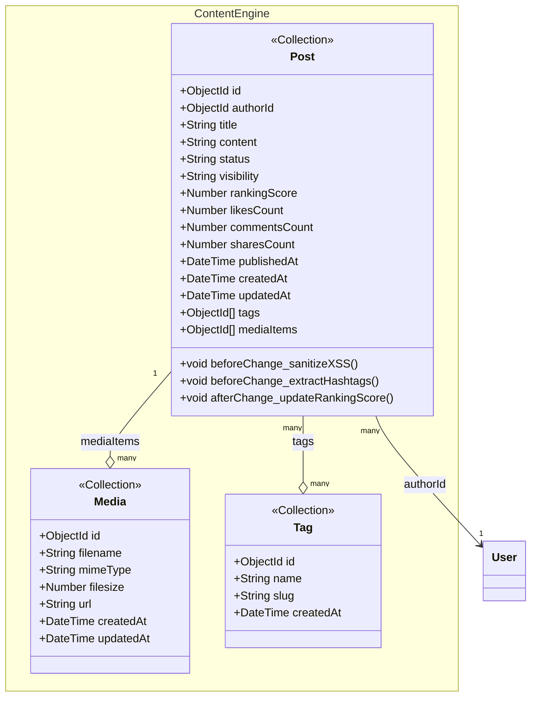

# class-m2 — Content Engine Class Diagram

> **Module**: M2 — Content Engine
> **Generated by**: Skill 2.5 (class-diagram-analyst)
> **Date**: 2026-02-20
> **Status**: ✅ Approved (IP2)
> **Source**: `Docs/life-2/diagrams/er-diagram.md` + `activity-diagrams/m2-a*.md` + `UseCase/use-case-m2-content-engine.md`

---

## Class Diagram (Mermaid)

> **Embedded Notes**:
> - `post_tags` — KHÔNG có class riêng. Embedded trong `Post.tags[]` dưới dạng `ObjectId[]` trỏ sang `Tag`
> - `post_media` — KHÔNG có class riêng. Embedded trong `Post.mediaItems[]` dưới dạng `ObjectId[]` trỏ sang `Media`
> - `rankingScore`: Computed Pattern (float, readOnly, cập nhật bởi hook/service)
> - `likesCount`, `commentsCount`, `sharesCount`: Computed Pattern (denormalized, readOnly)

---

## Traceability Table

| Entity | Field | Source | Assumption? |
|--------|-------|--------|------------|
| `Post` | `id` | `er-diagram.md#POSTS.id` | ❌ |
| `Post` | `authorId` | `er-diagram.md#POSTS.author_id` | ❌ |
| `Post` | `title` | `er-diagram.md#POSTS.title` | ❌ |
| `Post` | `content` | `er-diagram.md#POSTS.content` | ❌ |
| `Post` | `status` | `er-diagram.md#POSTS.status` | ❌ |
| `Post` | `visibility` | `er-diagram.md#POSTS.visibility` | ❌ |
| `Post` | `rankingScore` | `er-diagram.md#POSTS.ranking_score` | ❌ |
| `Post` | `likesCount` | `er-diagram.md#POSTS.likes_count` | ❌ |
| `Post` | `commentsCount` | `er-diagram.md#POSTS.comments_count` | ❌ |
| `Post` | `sharesCount` | `er-diagram.md#POSTS.shares_count` | ❌ |
| `Post` | `publishedAt` | `er-diagram.md#POSTS.published_at` | ❌ |
| `Post` | `createdAt` | `er-diagram.md#POSTS.created_at` | ❌ |
| `Post` | `updatedAt` | `er-diagram.md#POSTS.updated_at` | ❌ |
| `Post` | `tags[]` | `er-diagram.md (POST_TAGS join table → embedded)` | ❌ |
| `Post` | `mediaItems[]` | `er-diagram.md (POST_MEDIA join table → embedded)` | ❌ |
| `Post` | `beforeChange_sanitizeXSS()` | `activity-diagrams/m2-a1-editor-pipeline.md (C2: Sanitize HTML/JSON)` | ❌ |
| `Post` | `beforeChange_extractHashtags()` | `activity-diagrams/m2-a3-post-integrity.md` | ❌ |
| `Post` | `afterChange_updateRankingScore()` | `er-diagram.md#POSTS.ranking_score (note: feed ranking)` | ❌ |
| `Media` | `id` | `er-diagram.md (MEDIA entity implied by POST_MEDIA)` | ❌ |
| `Media` | `filename` | `UseCase/use-case-m2-content-engine.md#UC08 (media attachment)` | ❌ |
| `Media` | `mimeType` | `activity-diagrams/m2-a2-media-handler.md` | ❌ |
| `Media` | `filesize` | `activity-diagrams/m2-a2-media-handler.md` | ❌ |
| `Media` | `url` | `activity-diagrams/m2-a2-media-handler.md` | ❌ |
| `Media` | `createdAt` | `er-diagram.md (implied by Payload Upload collection)` | ❌ |
| `Media` | `updatedAt` | `er-diagram.md (implied by Payload Upload collection)` | ❌ |
| `Tag` | `id` | `er-diagram.md (TAGS entity implied by POST_TAGS)` | ❌ |
| `Tag` | `name` | `er-diagram.md (TAGS — tag name)` | ❌ |
| `Tag` | `slug` | `activity-diagrams/m2-a3-post-integrity.md (extractHashtags)` | ❌ |
| `Tag` | `createdAt` | `er-diagram.md (TAGS → has timestamps via N:N)` | ❌ |

---

## Assumption Register

> Không có assumption. `Media` fields suy luận từ PayloadCMS Upload collection pattern + m2-a2. `Tag` fields suy luận từ ERD + m2-a3. Không có field nào bịa.

---

## Embedded Documents (không có class riêng)

| Entity | embed_in | embed_as | Source |
|--------|----------|----------|--------|
| `post_tags` | `Post` | `Post.tags[]` (ObjectId[]) | `er-diagram.md (POST_TAGS join table)` + `module-map.yaml` |
| `post_media` | `Post` | `Post.mediaItems[]` (ObjectId[]) | `er-diagram.md (POST_MEDIA join table)` + `module-map.yaml` |

---

## Entity Overview

| Entity | Stereotype | Aggregate Root | Behaviors (summary) | Access (summary) |
|--------|-----------|---------------|---------------------|-----------------|
| `Post` | `<<Collection>>` | ✅ | beforeChange: sanitizeXSS, extractHashtags; afterChange: updateRankingScore | create: member (UC08); read: member/public; update: owner (UC09); delete: owner/admin |
| `Media` | `<<Collection>>` | ✅ | — (PayloadCMS Upload handles) | create: member; read: public; update: owner/admin; delete: owner/admin |
| `Tag` | `<<Collection>>` | ✅ | — | create: system (auto-extract); read: public; update: admin; delete: admin |
| `post_tags` | `<<EmbeddedDoc>>` | ❌ | — (embedded trong Post) | — |
| `post_media` | `<<EmbeddedDoc>>` | ❌ | — (embedded trong Post) | — |

---

## Notes

- **XSS Protection**: `beforeChange` hook trên Post chạy sanitizer (dompurify/ Lexical validator) — `m2-a1-editor-pipeline.md (C2)`.
- **Hashtag Extraction**: Hook phân tách `#tag` từ content, tạo/upsert Tag documents, gắn ID vào `Post.tags[]`.
- **Ranking Score**: Float field, cập nhật async bởi background service (không block write path).
- **Soft-delete**: Post dùng `status: banned | archived` — không hard-delete.
- **PayloadCMS Upload**: `Media` là Upload Collection riêng, có built-in file handling.

---

*Approved tại IP2 — Ready for YAML Contract generation.*
