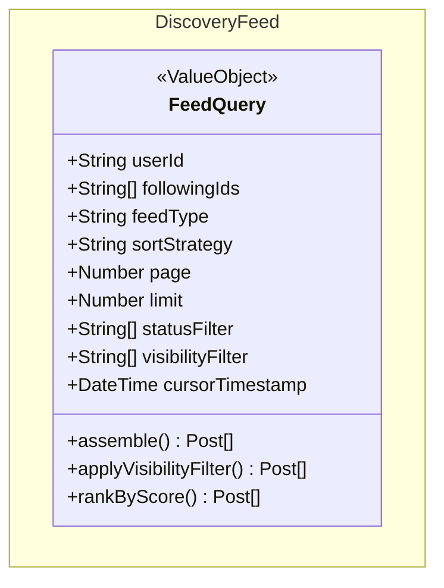

# class-m3 — Discovery Feed Class Diagram

> **Module**: M3 — Discovery Feed
> **Generated by**: Skill 2.5 (class-diagram-analyst)
> **Date**: 2026-02-20
> **Status**: ✅ Approved (IP2)
> **Source**: `Docs/life-2/diagrams/er-diagram.md` + `activity-diagrams/m3-a*.md` + `UseCase/use-case-m3-discovery-feed.md`

---

## Class Diagram (Mermaid)

> **⚠️ Module M3 đặc biệt**:
> - `FeedQuery` là `<<ValueObject>>` — KHÔNG có MongoDB collection riêng
> - M3 là cross-module query strategy: đọc từ `posts`, `connections`, `users` collections
> - Không có entity khác trong module này
> - `feedType`: enum `chronological | ranked | discover`
> - `sortStrategy`: enum `createdAt_desc | rankingScore_desc | mixed`

---

## Traceability Table

| Entity | Field | Source | Assumption? |
|--------|-------|--------|------------|
| `FeedQuery` | `userId` | `activity-diagrams/m3-a1-feed-assembler.md` | ❌ |
| `FeedQuery` | `followingIds[]` | `er-diagram.md (CONNECTIONS.following_id FK)` + `activity-diagrams/m3-a1-feed-assembler.md` | ❌ |
| `FeedQuery` | `feedType` | `activity-diagrams/m3-a1-feed-assembler.md` | ❌ |
| `FeedQuery` | `sortStrategy` | `er-diagram.md#POSTS.ranking_score` + `activity-diagrams/m3-a1-feed-assembler.md` | ❌ |
| `FeedQuery` | `page` | `activity-diagrams/m3-a1-feed-assembler.md (pagination)` | ❌ |
| `FeedQuery` | `limit` | `activity-diagrams/m3-a1-feed-assembler.md (pagination)` | ❌ |
| `FeedQuery` | `statusFilter[]` | `er-diagram.md#POSTS.status` + `activity-diagrams/m3-a1-feed-assembler.md` | ❌ |
| `FeedQuery` | `visibilityFilter[]` | `er-diagram.md#POSTS.visibility` + `activity-diagrams/m3-a4-visibility.md` | ❌ |
| `FeedQuery` | `cursorTimestamp` | `er-diagram.md#POSTS.created_at (index, feed sort)` | ❌ |
| `FeedQuery` | `assemble()` | `activity-diagrams/m3-a1-feed-assembler.md` | ❌ |
| `FeedQuery` | `applyVisibilityFilter()` | `activity-diagrams/m3-a1-feed-assembler.md` + `er-diagram.md#POSTS.visibility` | ❌ |
| `FeedQuery` | `rankByScore()` | `er-diagram.md#POSTS.ranking_score` | ❌ |

---

## Assumption Register

> Không có assumption. FeedQuery fields được trace từ activity-diagrams/m3-a1 + ER fields liên quan.

---

## Entity Overview

| Entity | Stereotype | Aggregate Root | Behaviors (summary) | Access (summary) |
|--------|-----------|---------------|---------------------|-----------------|
| `FeedQuery` | `<<ValueObject>>` | ❌ (No MongoDB collection) | assemble(), applyVisibilityFilter(), rankByScore() | read: member only (authenticated) |

---

## Notes

- **No MongoDB Collection**: M3 không tạo collection mới. Đây là pattern query tổng hợp từ `posts`, `connections`, `users`.
- **Cross-module**: FeedQuery đọc `POSTS` (M2), `CONNECTIONS` (M4), `USERS` (M1) để xây dựng feed.
- **Chronological Feed**: Sort by `createdAt DESC` — dùng cursor-based pagination.
- **Ranked Feed**: Sort by `rankingScore DESC` — dùng `posts.ranking_score` field (M2).
- **Visibility Logic**: Filter posts theo `post.visibility` và `connections` của user xem.
- **Search** (`m3-a2-search-engine.md`): Dùng MongoDB text index trên `posts.title` + `posts.content`.
- **Discovery Recommendation** (`m3-a3`): Dùng `tags`, `connections` để gợi ý nội dung.

---

*Approved tại IP2 — Ready for YAML Contract generation.*
