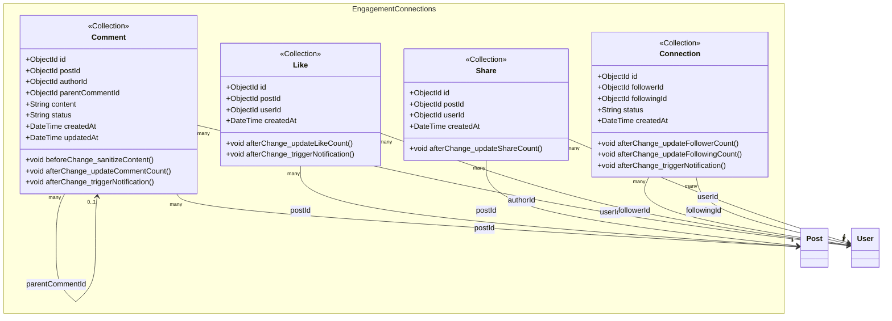

# class-m4 — Engagement & Connections Class Diagram

> **Module**: M4 — Engagement & Connections
> **Generated by**: Skill 2.5 (class-diagram-analyst)
> **Date**: 2026-02-20
> **Status**: ✅ Approved (IP2)
> **Source**: `Docs/life-2/diagrams/er-diagram.md` + `activity-diagrams/m4-a*.md` + `UseCase/use-case-m4-engagement-connections.md`

---

## Class Diagram (Mermaid)

> **Compound Index Notes**:
> - `Like`: Unique index on `(postId, userId)` — một user chỉ like 1 lần per post
> - `Connection`: Unique index on `(followerId, followingId)` — không follow 2 lần
> - `Comment.parentCommentId`: nullable — null = top-level comment, non-null = threaded reply
> - `Share`: ⚠️ **[ASSUMPTION]** — Fields provisional (thiếu Entity Dict trong ER)

---

## Traceability Table

| Entity | Field | Source | Assumption? |
|--------|-------|--------|------------|
| `Comment` | `id` | `er-diagram.md#COMMENTS.id` | ❌ |
| `Comment` | `postId` | `er-diagram.md#COMMENTS.post_id` | ❌ |
| `Comment` | `authorId` | `er-diagram.md#COMMENTS.author_id` | ❌ |
| `Comment` | `parentCommentId` | `er-diagram.md#COMMENTS.parent_comment_id` | ❌ |
| `Comment` | `content` | `er-diagram.md#COMMENTS.content` | ❌ |
| `Comment` | `status` | `er-diagram.md#COMMENTS.status` | ❌ |
| `Comment` | `createdAt` | `er-diagram.md#COMMENTS.created_at` | ❌ |
| `Comment` | `updatedAt` | `er-diagram.md#COMMENTS.updated_at` | ❌ |
| `Comment` | `beforeChange_sanitizeContent()` | `activity-diagrams/m4-a2-engagement-logic.md (C5: Kiểm tra từ cấm)` | ❌ |
| `Comment` | `afterChange_updateCommentCount()` | `activity-diagrams/m4-a2-engagement-logic.md (C4 → D2 → D1)` | ❌ |
| `Comment` | `afterChange_triggerNotification()` | `activity-diagrams/m4-a2-engagement-logic.md (C6: Gửi thông báo Local)` | ❌ |
| `Like` | `id` | `er-diagram.md#LIKES.id` | ❌ |
| `Like` | `postId` | `er-diagram.md#LIKES.post_id` | ❌ |
| `Like` | `userId` | `er-diagram.md#LIKES.user_id` | ❌ |
| `Like` | `createdAt` | `er-diagram.md#LIKES.created_at` | ❌ |
| `Like` | `afterChange_updateLikeCount()` | `activity-diagrams/m4-a2-engagement-logic.md (C3: Tăng/Giảm Like Count → D1)` | ❌ |
| `Like` | `afterChange_triggerNotification()` | `activity-diagrams/m4-a2-engagement-logic.md (C6: Gửi thông báo Local)` | ❌ |
| `Connection` | `id` | `er-diagram.md#CONNECTIONS.id` | ❌ |
| `Connection` | `followerId` | `er-diagram.md#CONNECTIONS.follower_id` | ❌ |
| `Connection` | `followingId` | `er-diagram.md#CONNECTIONS.following_id` | ❌ |
| `Connection` | `status` | `er-diagram.md#CONNECTIONS.status` | ❌ |
| `Connection` | `createdAt` | `er-diagram.md#CONNECTIONS.created_at` | ❌ |
| `Connection` | `afterChange_updateFollowerCount()` | `activity-diagrams/m4-a1-friendship-handshake.md` | ❌ |
| `Connection` | `afterChange_updateFollowingCount()` | `activity-diagrams/m4-a1-friendship-handshake.md` | ❌ |
| `Connection` | `afterChange_triggerNotification()` | `activity-diagrams/m4-a1-friendship-handshake.md` | ❌ |
| `Share` | `id` | `er-diagram.md (SHARES entity — no Entity Dict)` | ✅ [ASSUMPTION] |
| `Share` | `postId` | `er-diagram.md (SHARES — implied from POSTS→SHARES relation)` | ✅ [ASSUMPTION] |
| `Share` | `userId` | `er-diagram.md (USERS→SHARES relation)` | ✅ [ASSUMPTION] |
| `Share` | `createdAt` | `er-diagram.md (implied — tương tự likes pattern)` | ✅ [ASSUMPTION] |
| `Share` | `afterChange_updateShareCount()` | `er-diagram.md#POSTS.shares_count (denormalized counter)` | ❌ |

---

## Assumption Register

| # | Entity | Field | Lý do Assumption | Đề xuất |
|---|--------|-------|-----------------|---------|
| 1 | `Share` | `id` | Không có Entity Dictionary trong ER cho SHARES | Thêm SHARES entity dict vào er-diagram.md |
| 2 | `Share` | `postId` | Suy luận từ quan hệ POSTS→SHARES trong ERD tổng quan | Xác nhận hoặc bổ sung ER |
| 3 | `Share` | `userId` | Suy luận từ quan hệ USERS→SHARES trong ERD tổng quan | Xác nhận hoặc bổ sung ER |
| 4 | `Share` | `createdAt` | Suy luận theo pattern tương tự `likes` collection | Xác nhận với team |

---

## Entity Overview

| Entity | Stereotype | Aggregate Root | Behaviors (summary) | Access (summary) |
|--------|-----------|---------------|---------------------|-----------------|
| `Comment` | `<<Collection>>` | ✅ | beforeChange: sanitize; afterChange: updateCount, triggerNotif | create: member (UC15); read: member/public; update: owner; delete: owner/admin |
| `Like` | `<<Collection>>` | ✅ | afterChange: updateLikeCount, triggerNotif | create/delete: member (UC14, toggle); read: member |
| `Connection` | `<<Collection>>` | ✅ | afterChange: updateFollowerCount, updateFollowingCount, triggerNotif | create: member (UC17); delete: owner; read: member |
| `Share` | `<<Collection>>` | ✅ ⚠️ | afterChange: updateShareCount | create: member (UC16); read: public |

---

## Compound Indexes

| Entity | Fields | Unique | Note |
|--------|--------|--------|------|
| `Like` | `(postId, userId)` | ✅ | Một user chỉ like 1 lần per post |
| `Connection` | `(followerId, followingId)` | ✅ | Không follow 2 lần cùng 1 user |

---

## Notes

- **Threaded Comments**: `parentCommentId` nullable — `null` = top-level, non-null = reply. Query GET /comments?postId=X returns threaded tree.
- **Like Toggle**: Like/Unlike là toggle — tạo mới = like, xóa record = unlike (không update, chỉ create/delete).
- **Connection Status**: `status: active` là giá trị duy nhất hiện tại — field future-proof cho approval flow.
- **Shares [ASSUMPTION]**: Cần xác nhận với team design để bổ sung Entity Dict vào er-diagram.md.
- **Notification Trigger**: `afterChange` hooks trong Like/Comment/Connection gọi M6 notification service.

---

*Approved tại IP2 — Ready for YAML Contract generation.*
