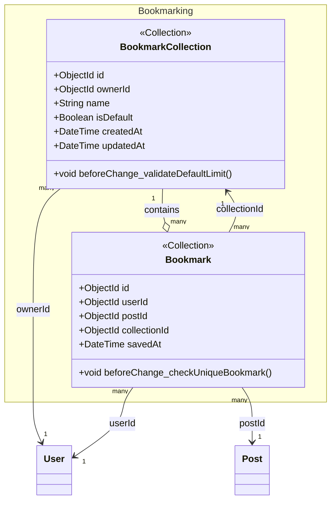

# class-m5 — Bookmarking Class Diagram

> **Module**: M5 — Bookmarking
> **Generated by**: Skill 2.5 (class-diagram-analyst)
> **Date**: 2026-02-20
> **Status**: ✅ Approved (IP2)
> **Source**: `Docs/life-2/diagrams/er-diagram.md` + `activity-diagrams/m5-a*.md` + `UseCase/use-case-m5-bookmarking.md`

---

## Class Diagram (Mermaid)

> **Compound Index Notes**:
> - `Bookmark`: Unique index on `(userId, postId)` — không bookmark cùng bài 2 lần
> - `BookmarkCollection.isDefault`: Mỗi user chỉ có 1 collection mặc định ("Tất cả")
> - `savedAt`: Sort field cho danh sách bookmark (mới nhất trước)

---

## Traceability Table

| Entity | Field | Source | Assumption? |
|--------|-------|--------|------------|
| `BookmarkCollection` | `id` | `er-diagram.md#BOOKMARK_COLLECTIONS.id` | ❌ |
| `BookmarkCollection` | `ownerId` | `er-diagram.md#BOOKMARK_COLLECTIONS.owner_id` | ❌ |
| `BookmarkCollection` | `name` | `er-diagram.md#BOOKMARK_COLLECTIONS.name` | ❌ |
| `BookmarkCollection` | `isDefault` | `er-diagram.md#BOOKMARK_COLLECTIONS.is_default` | ❌ |
| `BookmarkCollection` | `createdAt` | `er-diagram.md#BOOKMARK_COLLECTIONS.created_at` | ❌ |
| `BookmarkCollection` | `updatedAt` | `er-diagram.md#BOOKMARK_COLLECTIONS.updated_at` | ❌ |
| `BookmarkCollection` | `beforeChange_validateDefaultLimit()` | `er-diagram.md#BOOKMARK_COLLECTIONS.is_default (default false, "Tất cả")` + `activity-diagrams/m5-a2-collection-orchestrator.md` | ❌ |
| `Bookmark` | `id` | `er-diagram.md#BOOKMARKS.id` | ❌ |
| `Bookmark` | `userId` | `er-diagram.md#BOOKMARKS.user_id` | ❌ |
| `Bookmark` | `postId` | `er-diagram.md#BOOKMARKS.post_id` | ❌ |
| `Bookmark` | `collectionId` | `er-diagram.md#BOOKMARKS.collection_id` | ❌ |
| `Bookmark` | `savedAt` | `er-diagram.md#BOOKMARKS.saved_at` | ❌ |
| `Bookmark` | `beforeChange_checkUniqueBookmark()` | `er-diagram.md (Unique key: user_id, post_id)` + `activity-diagrams/m5-a1-bookmark-persistence.md` | ❌ |

---

## Assumption Register

> Không có assumption. Mọi field đều có nguồn trong ER Dictionary.

---

## Entity Overview

| Entity | Stereotype | Aggregate Root | Behaviors (summary) | Access (summary) |
|--------|-----------|---------------|---------------------|-----------------|
| `BookmarkCollection` | `<<Collection>>` | ✅ | beforeChange: validateDefaultLimit | create: member (UC20); read: owner; update: owner; delete: owner (non-default) |
| `Bookmark` | `<<Collection>>` | ✅ | beforeChange: checkUniqueBookmark | create/delete: member (UC19, toggle); read: owner |

---

## Compound Indexes

| Entity | Fields | Unique | Note |
|--------|--------|--------|------|
| `Bookmark` | `(userId, postId)` | ✅ | Unique constraint — không bookmark cùng bài 2 lần |

---

## Notes

- **Default Collection**: Mỗi user có 1 BookmarkCollection với `isDefault: true` tên "Tất cả" — tạo tự động khi user đăng ký.
- **Bookmark Toggle**: Tương tự Like — tạo = save, xóa = unsave. `beforeChange` kiểm tra duplicate trước khi tạo.
- **savedAt vs createdAt**: `savedAt` là timestamp sort cho bookmark list — điểm tham chiếu khi user lưu bài.
- **Visibility**: Bookmarks là private — chỉ owner mới xem được.
- **Atomic Updates**: MongoDB atomic operators đảm bảo consistency khi user thao tác nhanh (m5-bookmarking-summary.md).

---

*Approved tại IP2 — Ready for YAML Contract generation.*
