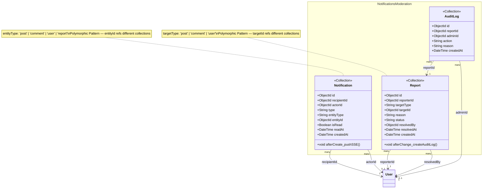

# class-m6 — Notifications & Moderation Class Diagram

> **Module**: M6 — Notifications & Moderation
> **Generated by**: Skill 2.5 (class-diagram-analyst)
> **Date**: 2026-02-20
> **Status**: ✅ Approved (IP2)
> **Source**: `Docs/life-2/diagrams/er-diagram.md` + `activity-diagrams/m6-a*.md` + `UseCase/use-case-m6-notifications-moderation.md`

---

## Class Diagram (Mermaid)

> **Polymorphic Pattern Notes**:
> - `Notification.entityType`: `post | comment | user | report`
> - `Notification.entityId`: ObjectId (không có FK constraint — polymorphic)
> - `Report.targetType`: `post | comment | user`
> - `Report.targetId`: ObjectId (không có FK constraint — polymorphic)
> - `AuditLog`: **Append-Only** — `update: nobody`, `delete: nobody`

---

## Traceability Table

| Entity | Field | Source | Assumption? |
|--------|-------|--------|------------|
| `Notification` | `id` | `er-diagram.md#NOTIFICATIONS.id` | ❌ |
| `Notification` | `recipientId` | `er-diagram.md#NOTIFICATIONS.recipient_id` | ❌ |
| `Notification` | `actorId` | `er-diagram.md#NOTIFICATIONS.actor_id` | ❌ |
| `Notification` | `type` | `er-diagram.md#NOTIFICATIONS.type` | ❌ |
| `Notification` | `entityType` | `er-diagram.md#NOTIFICATIONS.entity_type` | ❌ |
| `Notification` | `entityId` | `er-diagram.md#NOTIFICATIONS.entity_id` | ❌ |
| `Notification` | `isRead` | `er-diagram.md#NOTIFICATIONS.is_read` | ❌ |
| `Notification` | `readAt` | `er-diagram.md#NOTIFICATIONS.read_at` | ❌ |
| `Notification` | `createdAt` | `er-diagram.md#NOTIFICATIONS.created_at` | ❌ |
| `Notification` | `afterCreate_pushSSE()` | `activity-diagrams/m6-a1-sse-dispatcher.md` | ❌ |
| `Report` | `id` | `er-diagram.md#REPORTS.id` | ❌ |
| `Report` | `reporterId` | `er-diagram.md#REPORTS.reporter_id` | ❌ |
| `Report` | `targetType` | `er-diagram.md#REPORTS.target_type` | ❌ |
| `Report` | `targetId` | `er-diagram.md#REPORTS.target_id` | ❌ |
| `Report` | `reason` | `er-diagram.md#REPORTS.reason` | ❌ |
| `Report` | `status` | `er-diagram.md#REPORTS.status` | ❌ |
| `Report` | `resolvedBy` | `er-diagram.md#REPORTS.resolved_by` | ❌ |
| `Report` | `resolvedAt` | `er-diagram.md#REPORTS.resolved_at` | ❌ |
| `Report` | `createdAt` | `er-diagram.md#REPORTS.created_at` | ❌ |
| `Report` | `afterChange_createAuditLog()` | `activity-diagrams/m6-a2-report-pipeline.md (C4 → D2: AuditLogs)` | ❌ |
| `AuditLog` | `id` | `er-diagram.md#AUDIT_LOGS.id` | ❌ |
| `AuditLog` | `reportId` | `er-diagram.md#AUDIT_LOGS.report_id` | ❌ |
| `AuditLog` | `adminId` | `er-diagram.md#AUDIT_LOGS.admin_id` | ❌ |
| `AuditLog` | `action` | `er-diagram.md#AUDIT_LOGS.action` | ❌ |
| `AuditLog` | `reason` | `er-diagram.md#AUDIT_LOGS.reason` | ❌ |
| `AuditLog` | `createdAt` | `er-diagram.md#AUDIT_LOGS.created_at` | ❌ |

---

## Assumption Register

> Không có assumption. Mọi field đều có nguồn trong ER Dictionary.

---

## Entity Overview

| Entity | Stereotype | Aggregate Root | Behaviors (summary) | Access (summary) |
|--------|-----------|---------------|---------------------|-----------------|
| `Notification` | `<<Collection>>` | ✅ | afterCreate: pushSSE | create: system (M4 hooks); read: recipient (UC21); update: recipient (UC22-markRead); delete: system |
| `Report` | `<<Collection>>` | ✅ | afterChange: createAuditLog | create: member (UC23); read: admin (UC24); update: admin; delete: nobody |
| `AuditLog` | `<<Collection>>` | ✅ | — (Append-Only) | create: system; read: admin; update: nobody; delete: nobody |

---

## Patterns Applied

| Pattern | Entity | Description |
|---------|--------|-------------|
| **Polymorphic Pattern** | `Notification` | `entityType` + `entityId` trỏ đến nhiều collections khác nhau |
| **Polymorphic Pattern** | `Report` | `targetType` + `targetId` trỏ đến `post | comment | user` |
| **Append-Only Pattern** | `AuditLog` | Immutable audit trail — no update, no delete |
| **SSE Push** | `Notification` | Real-time dispatch qua Server-Sent Events sau khi create |

---

## Notes

- **Notifications type enum**: `like | comment | follow | report_update | system` — từ ER dict.
- **AuditLog action enum**: `hide_post | ban_user | dismiss_report | warn_user` — từ ER dict.
- **Report status enum**: `pending | resolved | dismissed` — moderation queue lifecycle.
- **SSE (Server-Sent Events)**: Không dùng Firebase hay external Push service — giữ local-first (m6-notifications-moderation-summary.md).
- **Immutable AuditLog**: PayloadCMS access control `update: () => false, delete: () => false` trên AuditLog collection.
- **M6→M1 dependency**: Admin có thể đổi `users.status: banned` từ M6 enforcement action (m6-a3).

---

*Approved tại IP2 — Ready for YAML Contract generation.*
