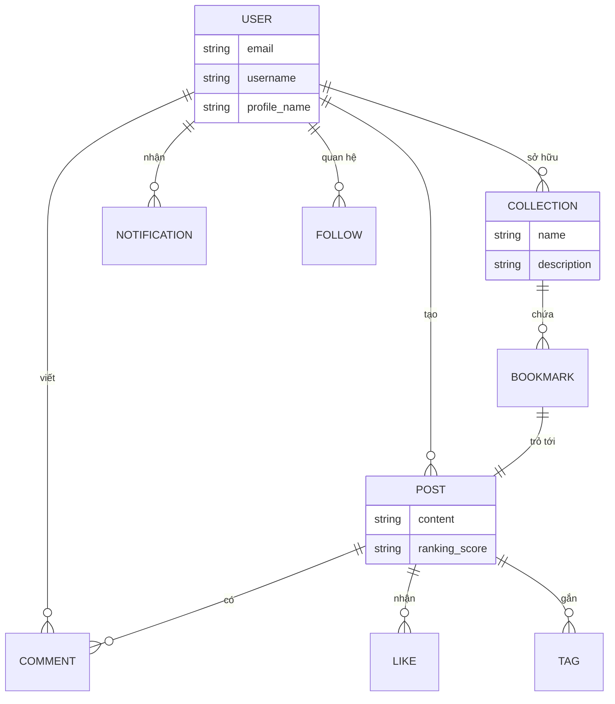

# Conceptual ER Diagram (Domain Model)

> **Mục đích:** Mô tả các thực thể nghiệp vụ (Logic Entities) và mối quan hệ giữa chúng để hiểu rõ Domain.  
> **Tư duy NoSQL:** Đây là bước làm rõ nghiệp vụ trước khi quyết định chiến lược Nhúng (Embed) hay Tham chiếu (Reference).

---

## Giải thích các thực thể chính

1. **User**: Người dùng trong hệ thống (Developer, Student).
2. **Post**: Đơn vị nội dung chính (Text, Image, Link).
3. **Collection**: Thư mục lưu trữ bookmark của User (Social Bookmarking).
4. **Follow**: Quan hệ giữa các User (Following/Followers).
5. **Notification**: Thông báo thời gian thực qua SSE.
