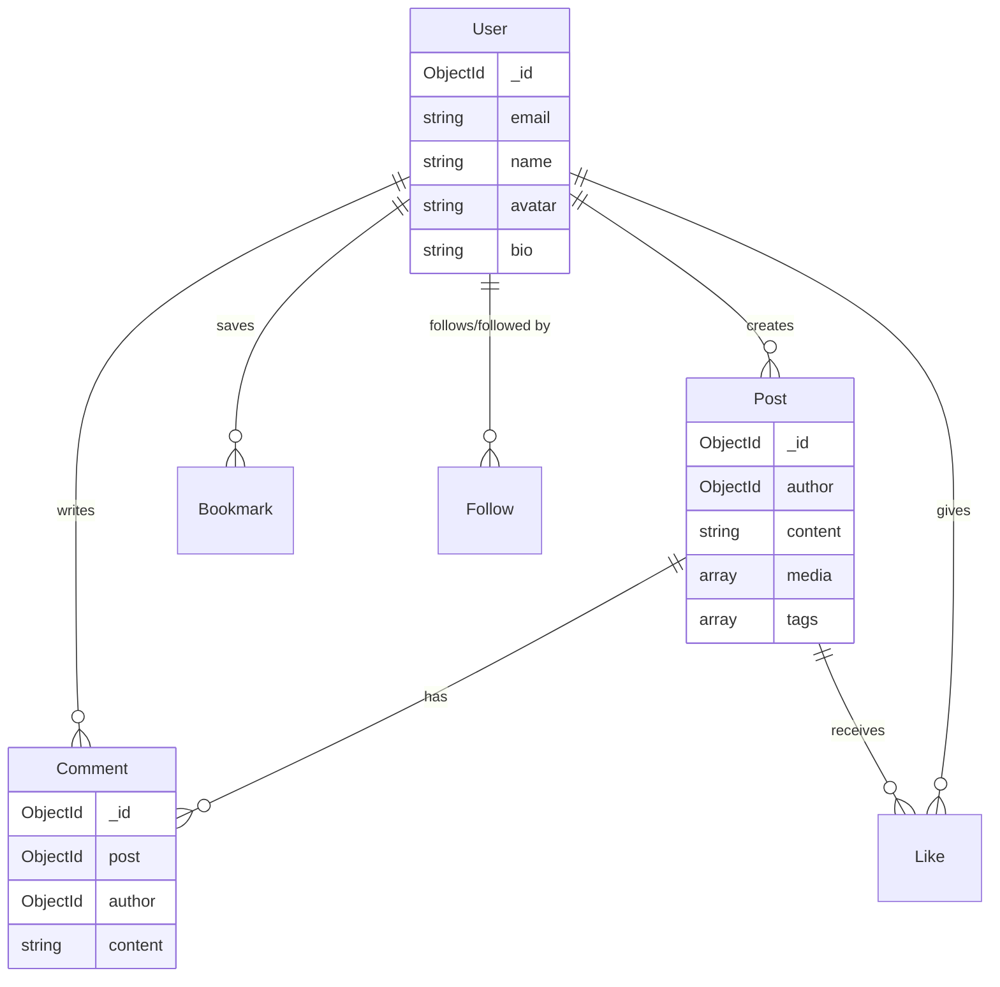

# ER Diagram

> **Mục đích:** Mô tả entities và relationships của hệ thống  
> **Format:** Mermaid erDiagram syntax  

---

<!-- Cập nhật với entities thực tế: User, Post, Comment, Like, Bookmark, Follow, Notification, Message -->
