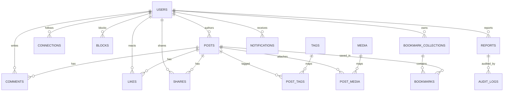
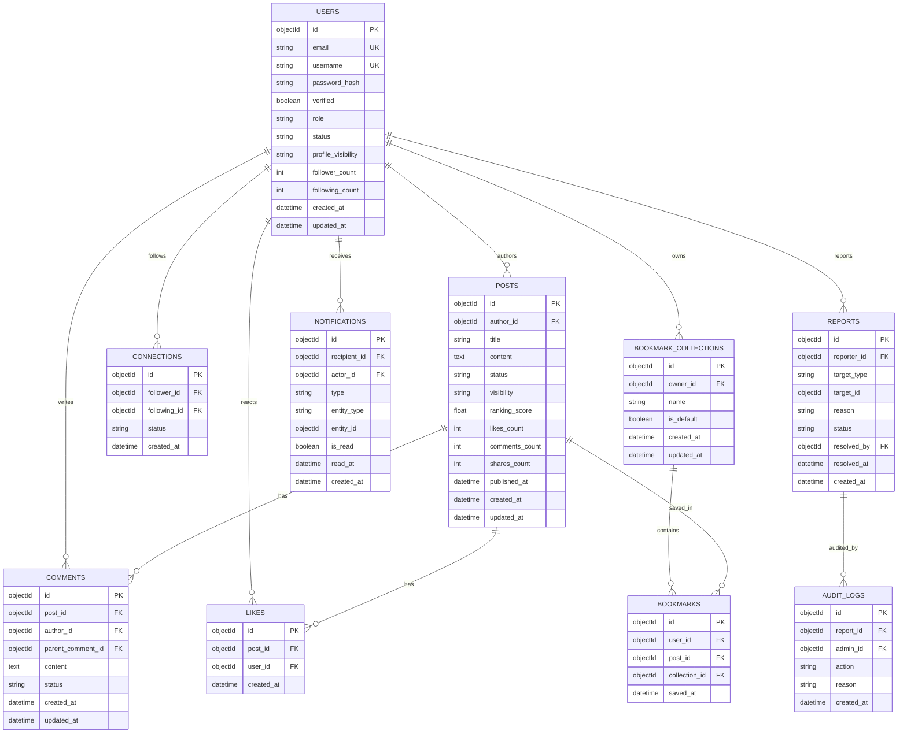

# ERD - Business to Physical Schema

> Muc tieu: dung duoc ngay cho thiet ke collection Payload/MongoDB, khong chi dung de minh hoa.
> Pham vi: M1 -> M6 (Auth/Profile, Content, Discovery, Engagement, Bookmarking, Notification/Moderation).

---

## 1) ERD Tong Quan

## 2) ERD Co Thuoc Tinh Cot Loi

## 3) Entity Dictionary (Chi Tiet De Implement)

### `users`
| Field | Type | Required | Constraint | Note |
|---|---|---|---|---|
| id | ObjectId | yes | PK | Payload `id` |
| email | string | yes | UK, index | auth/login |
| username | string | yes | UK, index | profile public |
| password_hash | string | yes | - | bcrypt |
| verified | boolean | yes | default `false` | M1 verify email |
| role | enum | yes | `member/admin` | RBAC |
| status | enum | yes | `active/inactive/banned` | moderation |
| profile_visibility | enum | yes | `public/followers/private` | privacy |
| follower_count | int | yes | default `0` | denormalized |
| following_count | int | yes | default `0` | denormalized |
| created_at | datetime | yes | index | - |
| updated_at | datetime | yes | - | - |

### `posts`
| Field | Type | Required | Constraint | Note |
|---|---|---|---|---|
| id | ObjectId | yes | PK | - |
| author_id | ObjectId | yes | FK -> users.id, index | owner |
| title | string | no | index text | optional |
| content | text | yes | text index | search |
| status | enum | yes | `draft/published/banned/archived`, index | moderation |
| visibility | enum | yes | `public/friends/private`, index | M2-A4 |
| ranking_score | float | no | index desc | feed ranking |
| likes_count | int | yes | default `0` | denormalized |
| comments_count | int | yes | default `0` | denormalized |
| shares_count | int | yes | default `0` | denormalized |
| published_at | datetime | no | index | - |
| created_at | datetime | yes | index | feed sort |
| updated_at | datetime | yes | - | - |

### `comments`
| Field | Type | Required | Constraint | Note |
|---|---|---|---|---|
| id | ObjectId | yes | PK | - |
| post_id | ObjectId | yes | FK -> posts.id, index | target post |
| author_id | ObjectId | yes | FK -> users.id, index | writer |
| parent_comment_id | ObjectId | no | FK -> comments.id, index | nested reply |
| content | text | yes | - | - |
| status | enum | yes | `visible/hidden/deleted`, index | moderation |
| created_at | datetime | yes | index | - |
| updated_at | datetime | yes | - | - |

### `likes`
| Field | Type | Required | Constraint | Note |
|---|---|---|---|---|
| id | ObjectId | yes | PK | - |
| post_id | ObjectId | yes | FK -> posts.id | - |
| user_id | ObjectId | yes | FK -> users.id | - |
| created_at | datetime | yes | - | - |

Unique key de tranh like lap: `(post_id, user_id)`.

### `connections`
| Field | Type | Required | Constraint | Note |
|---|---|---|---|---|
| id | ObjectId | yes | PK | - |
| follower_id | ObjectId | yes | FK -> users.id | actor |
| following_id | ObjectId | yes | FK -> users.id | target |
| status | enum | yes | `active` | future-proof |
| created_at | datetime | yes | - | - |

Unique key: `(follower_id, following_id)`.

### `bookmark_collections`
| Field | Type | Required | Constraint | Note |
|---|---|---|---|---|
| id | ObjectId | yes | PK | - |
| owner_id | ObjectId | yes | FK -> users.id, index | owner |
| name | string | yes | index | folder name |
| is_default | boolean | yes | default `false` | "Tat ca" |
| created_at | datetime | yes | - | - |
| updated_at | datetime | yes | - | - |

### `bookmarks`
| Field | Type | Required | Constraint | Note |
|---|---|---|---|---|
| id | ObjectId | yes | PK | - |
| user_id | ObjectId | yes | FK -> users.id | owner |
| post_id | ObjectId | yes | FK -> posts.id | saved post |
| collection_id | ObjectId | yes | FK -> bookmark_collections.id | folder |
| saved_at | datetime | yes | index | sort |

Unique key de tranh save trung: `(user_id, post_id)`.

### `notifications`
| Field | Type | Required | Constraint | Note |
|---|---|---|---|---|
| id | ObjectId | yes | PK | - |
| recipient_id | ObjectId | yes | FK -> users.id, index | inbox owner |
| actor_id | ObjectId | no | FK -> users.id | source user |
| type | enum | yes | `like/comment/follow/report_update/system`, index | M6 |
| entity_type | enum | yes | `post/comment/user/report` | polymorphic |
| entity_id | ObjectId | no | index | target entity |
| is_read | boolean | yes | default `false`, index | badge |
| read_at | datetime | no | - | mark read |
| created_at | datetime | yes | index | sort desc |

### `reports`
| Field | Type | Required | Constraint | Note |
|---|---|---|---|---|
| id | ObjectId | yes | PK | - |
| reporter_id | ObjectId | yes | FK -> users.id, index | who reports |
| target_type | enum | yes | `post/comment/user`, index | polymorphic |
| target_id | ObjectId | yes | index | reported object |
| reason | string | yes | - | violation type |
| status | enum | yes | `pending/resolved/dismissed`, index | moderation queue |
| resolved_by | ObjectId | no | FK -> users.id | admin |
| resolved_at | datetime | no | - | - |
| created_at | datetime | yes | index | queue ordering |

### `audit_logs`
| Field | Type | Required | Constraint | Note |
|---|---|---|---|---|
| id | ObjectId | yes | PK | - |
| report_id | ObjectId | yes | FK -> reports.id, index | trace report |
| admin_id | ObjectId | yes | FK -> users.id, index | moderator |
| action | enum | yes | `hide_post/ban_user/dismiss_report/warn_user` | enforcement |
| reason | string | yes | - | audit detail |
| created_at | datetime | yes | index | chronology |

---

## 4) Ghi Chu Kien Truc

1. ERD tren la **business schema** de phan tich/trace requirement.
2. Khi toi uu read cho M5, co the chuyen `bookmarks` thanh embedded array trong `bookmark_collections`.
3. Feed ranking dung denormalized counters + `ranking_score` (cap nhat boi hook/service).
4. Soft-delete uu tien qua `status`, tranh hard-delete voi post/comment/user.
