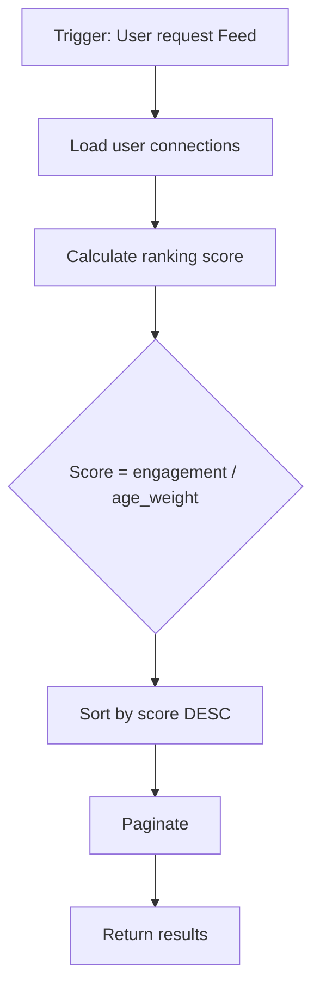
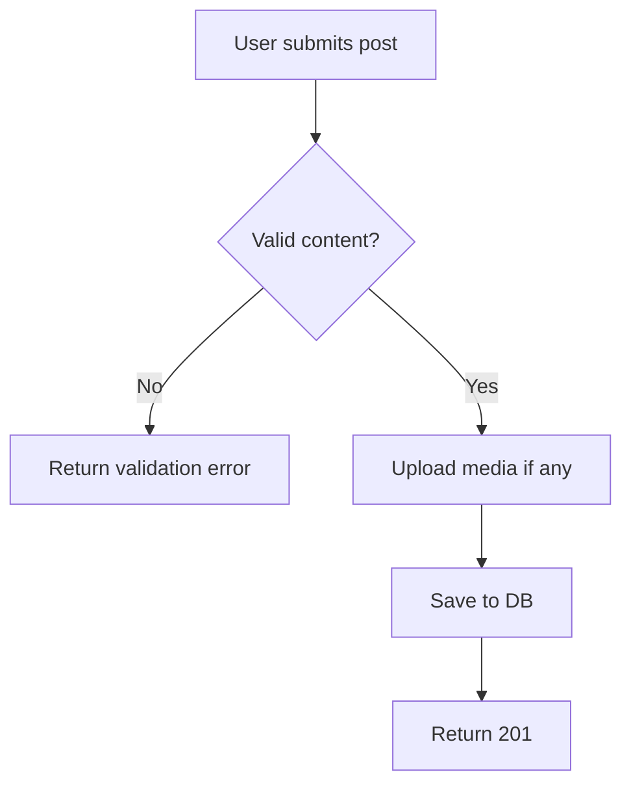

# Flow Diagrams

> **Mục đích:** Mô tả business logic, decision points  
> **Format:** Mermaid flowchart  

---

## News Feed Ranking Flow

## Post Creation Flow

<!-- Thêm flows cho: Bookmark save, Notification trigger -->
