# Flow Diagram: Lưu/Bỏ lưu bài viết Bookmark (UC19)

```mermaid
flowchart TD
  subgraph User ["👤 User"]
    direction TB
    U1(["Bắt đầu: Bấm icon Bookmark (Ribbon) <br/>ở góc bài viết"])
    U2{"Trạng thái icon Bookmark là lưu hay bỏ lưu?"}
    U3(["Kết thúc: Hiện Toast: 'Đã bỏ lưu'"])
    U4(["Kết thúc: Gọi Custom Modal chọn Collection (UC20) hoặc <br/>lưu nhanh mặc định vào Quick Save"])
  end
  subgraph System ["⚙️ System"]
    direction TB
    S1("Kiểm tra Token User đang gửi API")
    S2("API PATCH /api/v1/collections/default_id/save")
    S3("API PATCH /api/v1/collections/default_id/unsave")
    S4("Sử dụng $push trong Update payload")
    S5("Sử dụng $pull trong Update payload")
  end
  subgraph DB ["🗄️ Database"]
    direction TB
    D1("Update Bookmark Default Collection")
  end

  U1 --> U2
  U2 -- "Bỏ Lưu (Đã lưu)" --> S3
  U2 -- "Lưu (Mới)" --> S2

  S3 --> S1 --> S5 --> D1 --> U3
  S2 --> S1 --> S4 --> D1 --> U4

  %% UC-ID: UC19
  %% Business Function: Nút Quick Save Bookmark Toggle
```

## Assumptions
- Spec M5 quy định Bookmark mặc định nằm ở Collection "My Bookmarks" (Dạng Quick Save).
- Backend Collection `user_collections` chứa items dạng list embedded object.
