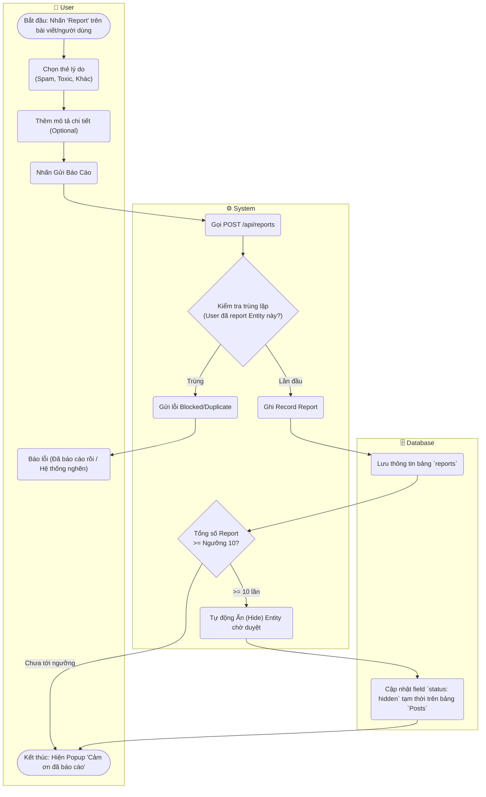

# Flow Diagram: Báo cáo vi phạm (UC23)

## Assumptions
- Có Auto-action ẩn bài viết nếu có 10 người trở lên báo cáo cùng một ID theo Spec M6 (Optional Features).
- Tích hợp cảnh báo trùng lặp Report để chống Spam click report.
