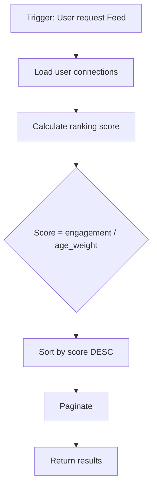
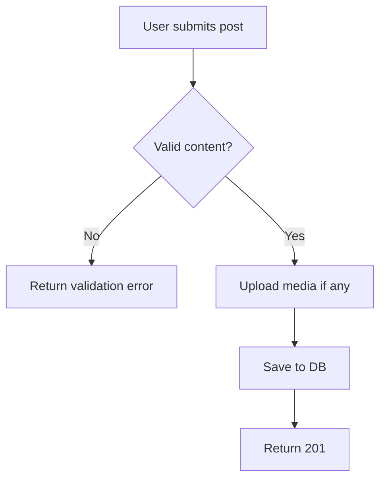
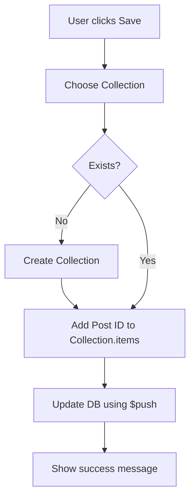
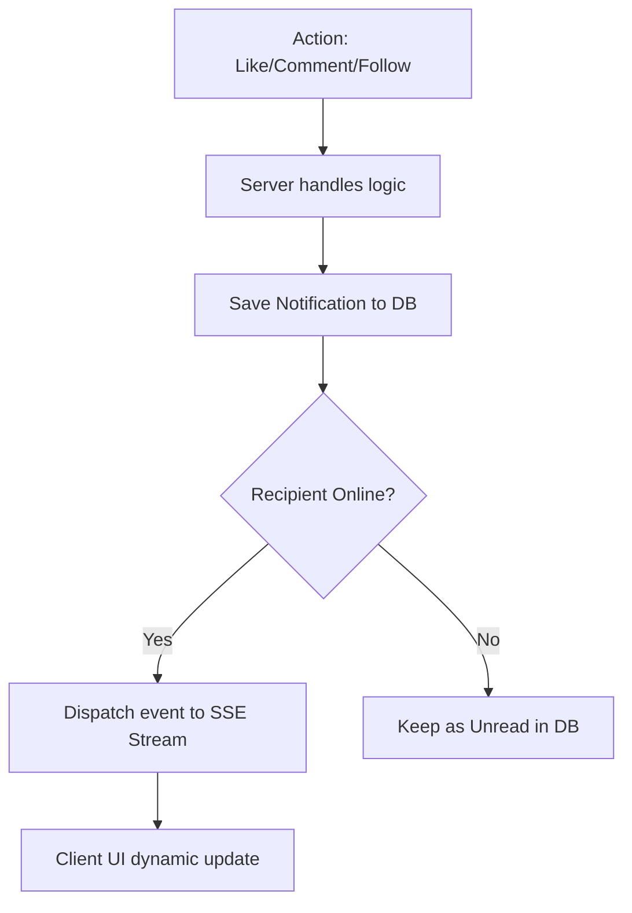

# Flow Diagrams

> **Mục đích:** Mô tả business logic, decision points  
> **Format:** Mermaid flowchart  

---

## News Feed Ranking Flow

## Post Creation Flow

## Bookmark Save Flow

## Notification Trigger Flow (Event-Driven)

---
*Ghi chú: Các luồng xử lý trên đảm bảo tính nhất quán giữa UI và Data thông qua cơ chế tối ưu NoSQL.* 🥰
