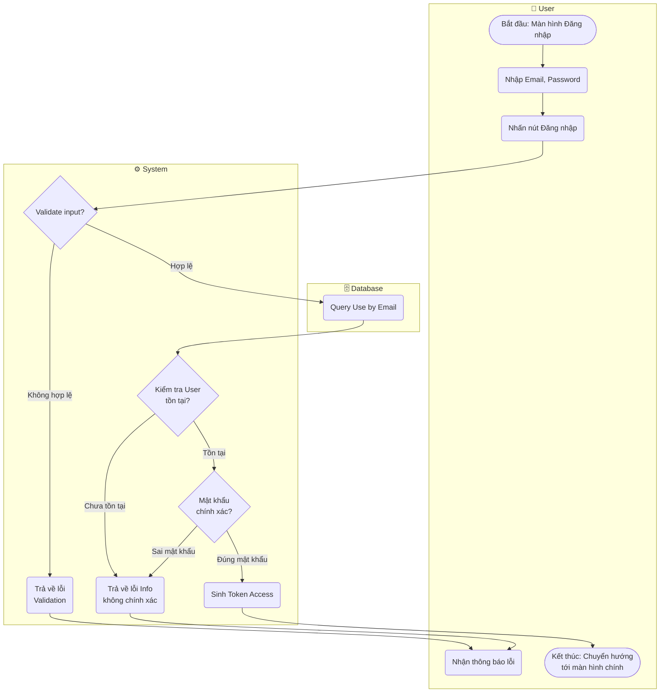

# Flow Diagram: Đăng nhập Email/Password (UC02)

## Assumptions
- Dùng session hoặc jwt cho Token Access (theo mặc định của PayloadCMS).
- Việc xử lý "Quên mật khẩu" có thể chia rẽ nhánh tại U4 nếu người dùng quên mật khẩu (nhưng không thể hiện trong Use Case này để giữ độ tinh giản).
