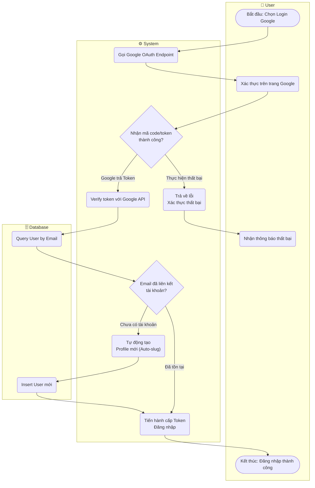

# Flow Diagram: Đăng nhập OAuth Google (UC03)

## Assumptions
- Giả định hệ thống sẽ tự động tạo `username` auto-slug từ email nếu chưa tồn tại (giống như spec yêu cầu).
- Password sẽ được hệ thống sinh ngẫu nhiên mạnh bên dưới hoặc null (Google Auth).
