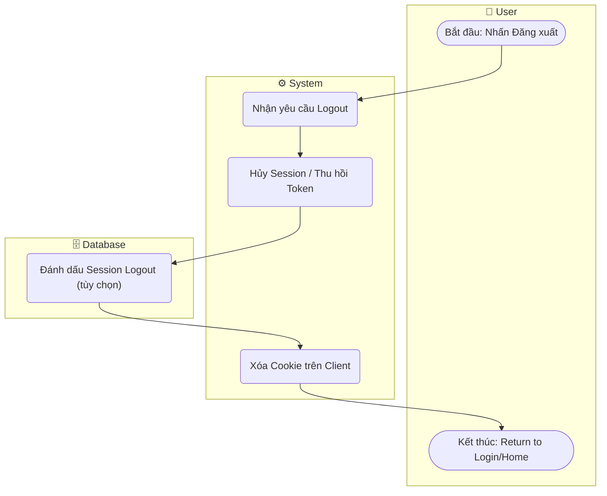

# Flow Diagram: Đăng xuất (UC04)

```mermaid
flowchart TD
  subgraph User ["👤 User"]
    direction TB
    U1(["Bắt đầu: Nhấn Đăng xuất"])
    U2(["Kết thúc: Return to Login/Home"])
  end
  subgraph System ["⚙️ System"]
    direction TB
    S1("Nhận yêu cầu Logout")
    S2("Hủy Session / Thu hồi Token")
    S3("Xóa Cookie trên Client")
  end
  subgraph DB ["🗄️ Database"]
    direction TB
    D1("Đánh dấu Session Logout (tùy chọn)")
  end

  U1 --> S1
  S1 --> S2 --> D1
  D1 --> S3
  S3 --> U2

  %% UC-ID: UC04
  %% Business Function: Đăng xuất
```

## Assumptions
- Hủy Session Token hiện tại trên Memory hoặc Database.
- Phía Frontend sẽ tự remove Local Storage hoặc Xóa Cookie bảo mật chứa Token.
