# Flow Diagram: Xem news feed (UC11)

```mermaid
flowchart TD
  subgraph User ["👤 User"]
    direction TB
    U1(["Bắt đầu: Mở màn hình chính (News Feed)"])
    U2("Kéo xuống cuối trang<br/>(Infinite Scroll)")
    U3(["Kết thúc: Thấy Feed mới nhất"])
    U4(["Kết thúc: Hiển thị LoadingSpinner/Empty State"])
  end
  subgraph System ["⚙️ System"]
    direction TB
    S1("Gọi API /api/v1/feed")
    S2{"Cần load theo page/limit?"}
    S3{"Có bài viết nào không?"}
    S4("Áp dụng thuật toán Time-decay<br/>+ Engagement để sắp xếp")
    S5("Trả về mảng bài viết")
  end
  subgraph DB ["🗄️ Database"]
    direction TB
    D1("Query bài viết & Populate Author/Media")
  end

  U1 --> S1
  U2 --> S2
  S2 -- "Page > 1" --> S1
  S2 -- "Chưa cần" --> U3

  S1 --> D1 --> S4 --> S3
  S3 -- "Không" --> U4
  S3 -- "Có" --> S5 --> U3

  %% UC-ID: UC11
  %% Business Function: Xem news feed dự án
```

## Assumptions
- Thuật toán Ranking Score `score = (likesCount + commentsCount*2 + sharesCount*3) / (1 + hoursSincePost / 24)^1.8` đã được cron job và hook tính sẵn trong field `rankingScore` ở data layer (đã spec trong M3). Query DB chỉ cần `sort: '-rankingScore'`.
