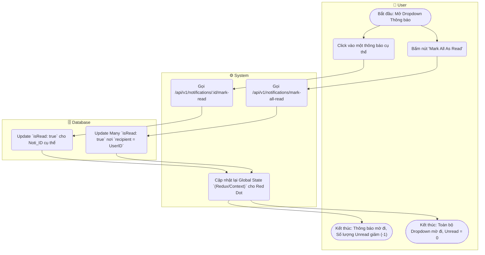

# Flow Diagram: Đánh dấu đã đọc thông báo (UC22)

```mermaid
flowchart TD
  subgraph User ["👤 User"]
    direction TB
    U1(["Bắt đầu: Mở Dropdown Thông báo"])
    U2("Click vào một thông báo cụ thể")
    U3(["Kết thúc: Thông báo mờ đi, Số lượng Unread giảm (-1)"])
    U4("Bấm nút 'Mark All As Read'")
    U5(["Kết thúc: Toàn bộ Dropdown mờ đi, Unread = 0"])
  end
  subgraph System ["⚙️ System"]
    direction TB
    S1("Gọi /api/v1/notifications/:id/mark-read")
    S2("Gọi /api/v1/notifications/mark-all-read")
    S3("Cập nhật lại Global State `(Redux/Context)` cho Red Dot")
  end
  subgraph DB ["🗄️ Database"]
    direction TB
    D1("Update `isRead: true` cho Noti_ID cụ thể")
    D2("Update Many `isRead: true` nơi `recipient = UserID`")
  end

  U1 --> U2 --> S1
  U1 --> U4 --> S2

  S1 --> D1 --> S3 --> U3
  S2 --> D2 --> S3 --> U5

  %% UC-ID: UC22
  %% Business Function: Đánh dấu đã đọc
```

## Assumptions
- Hỗ trợ cả hai chế độ: click từng Notification để đọc và tính năng "Đánh dấu tất cả đã đọc" (khá cần thiết cho UX).
