# Flow Diagram: Nhận thông báo realtime (UC21)

```mermaid
flowchart TD
  subgraph User ["👤 User"]
    direction TB
    U1(["Bắt đầu: User đang mở App/Website"])
    U2("Lắng nghe đường truyền SSE (/api/v1/notifications/stream)")
    U3(["Kết thúc: Hiển thị In-App Toast + Red Dot Dropdown"])
    U4("Hiển thị chuông mặc định không đổi")
  end
  subgraph System ["⚙️ System"]
    direction TB
    S1("Server Push Event (SSE stream)")
    S2{"Có sự kiện mới<br/>(Like, Cmt, Follow)?"}
    S3("Dispatch Event tới Channel User_ID tương ứng")
    S4("Không gửi dữ liệu")
  end
  subgraph DB ["🗄️ Database"]
    direction TB
    D1("Collection Notifications lưu `isRead: false` và `type`")
    D2("Lắng nghe Change Stream từ Db (Hook Event Trigger)")
  end

  U1 --> U2 --> S1
  S1 -. Lắng nghe liên tục .-> D2
  
  D1 --> D2 --> S2
  S2 -- "Không" --> S4 --> U4
  S2 -- "Có" --> S3
  
  S3 --> U3

  %% UC-ID: UC21
  %% Business Function: Theo dõi thông báo thời gian thực Server-Sent Events
```

## Assumptions
- Dùng Server-Sent Events (SSE) để tiết kiệm so với WebSocket, PayloadCMS backend support kết nối Stream Data.
- Sự kiện trigger SSE dựa trên Hook `afterChange` của Notifications collection.
