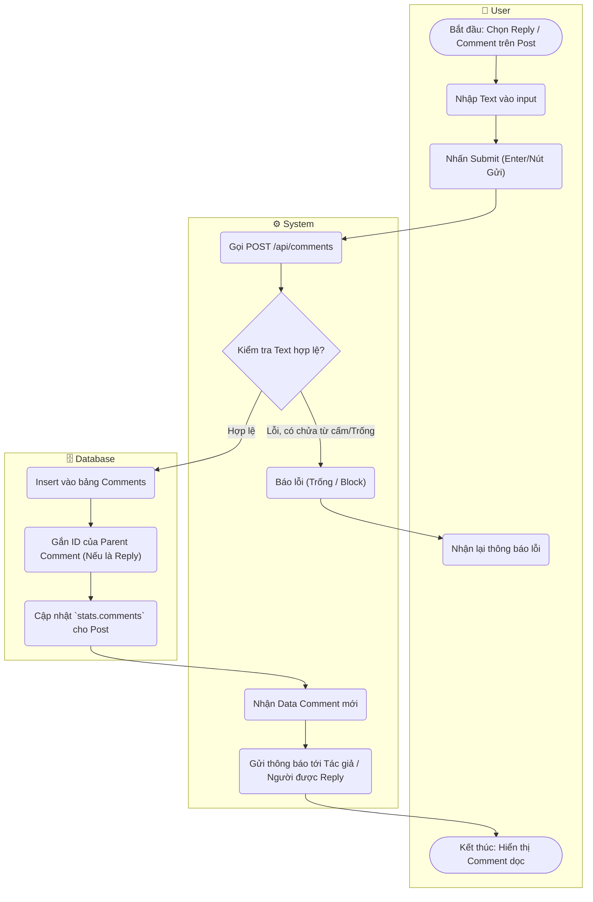

# Flow Diagram: Bình luận và phản hồi lồng nhau (UC15)

## Assumptions
- Dữ liệu Nested comment có thể được lưu ở Field `replies` (Array trong payload) hoặc Ref (ParentId). Ở đây spec M4 để lại 2 option `Array of objects` (optional cho MVP) -> gộp chung logic.
