# Flow Diagram: Bình luận và phản hồi lồng nhau (UC15)

```mermaid
flowchart TD
  subgraph User ["👤 User"]
    direction TB
    U1(["Bắt đầu: Chọn Reply / Comment trên Post"])
    U2("Nhập Text vào input")
    U3("Nhấn Submit (Enter/Nút Gửi)")
    U4(["Kết thúc: Hiển thị Comment dọc"])
    U5("Nhận lại thông báo lỗi")
  end
  subgraph System ["⚙️ System"]
    direction TB
    S1("Gọi POST /api/comments")
    S2{"Kiểm tra Text hợp lệ?"}
    S3("Gửi thông báo tới Tác giả / Người được Reply")
    S4("Báo lỗi (Trống / Block)")
    S5("Nhận Data Comment mới")
  end
  subgraph DB ["🗄️ Database"]
    direction TB
    D1("Insert vào bảng Comments")
    D2("Gắn ID của Parent Comment (Nếu là Reply)")
    D3("Cập nhật `stats.comments` cho Post")
  end

  U1 --> U2 --> U3 --> S1 --> S2
  S2 -- "Lỗi, có chửa từ cấm/Trống" --> S4 --> U5
  S2 -- "Hợp lệ" --> D1 --> D2
  
  D2 --> D3 --> S5 --> S3
  S3 --> U4

  %% UC-ID: UC15
  %% Business Function: Bình luận dạng cây (Tree/Nested)
```

## Assumptions
- Dữ liệu Nested comment có thể được lưu ở Field `replies` (Array trong payload) hoặc Ref (ParentId). Ở đây spec M4 để lại 2 option `Array of objects` (optional cho MVP) -> gộp chung logic.
