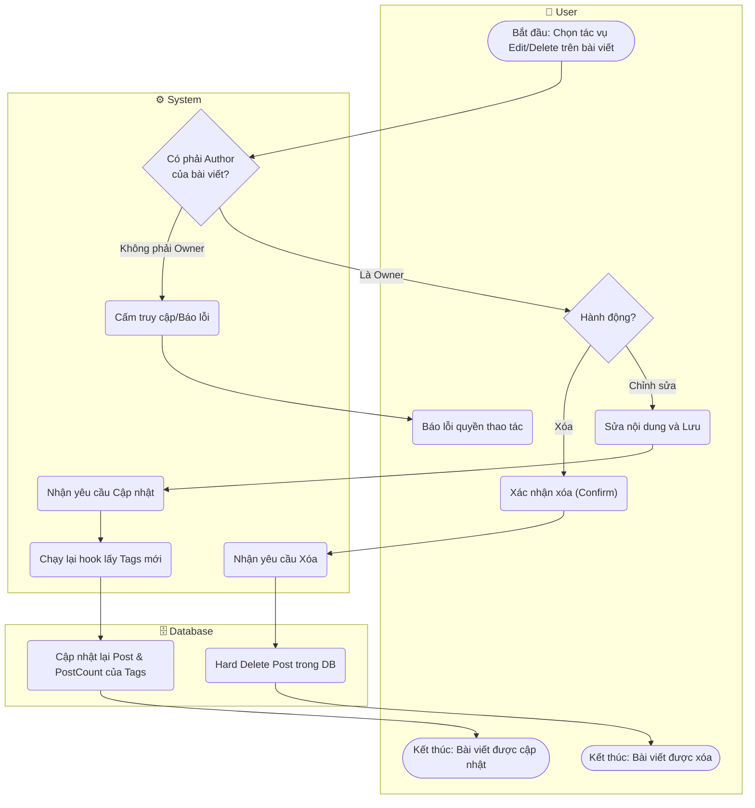

# Flow Diagram: Chỉnh sửa/Xóa bài viết (UC09)

## Assumptions
- Quyền Update / Delete đối với Post được giới hạn ở PayloadCMS Access Control `(req, id) => req.user.id === post.author`. Admin có thể có quyền cao hơn (kế thừa) nhưng UC09 áp dụng chính cho User (Member).
