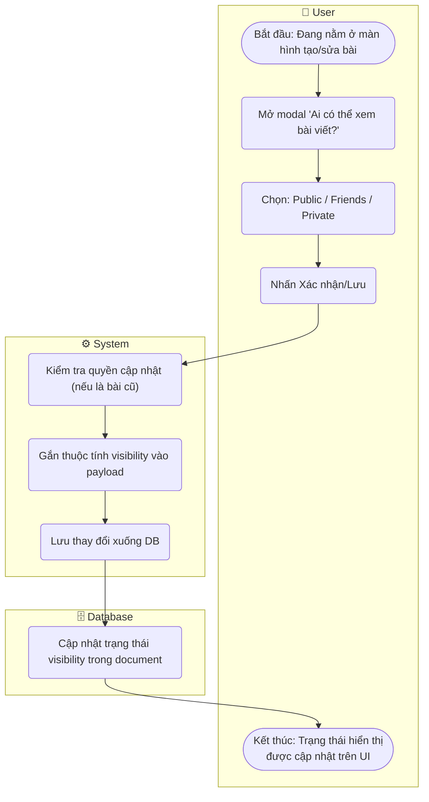

# Flow Diagram: Thiết lập quyền riêng tư bài viết (UC10)

## Assumptions
- Mặc dù specs chưa đề cập chi tiết field `visibility`, tính năng này được liệt kê trong use-case overview. Giả định có field `visibility: enum('public', 'friends', 'private')` được thiết lập khi push bài lên DB (PATCH hoặc POST request).
