# Flow Diagram: Quản lý hồ sơ cá nhân (UC06)

```mermaid
flowchart TD
  subgraph User ["👤 User"]
    direction TB
    U1(["Bắt đầu: Truy cập Edit Profile"])
    U2("Chỉnh sửa Bio, <br/>Avatar, Social Links")
    U3("Nhấn nút Lưu (Save)")
    U4(["Kết thúc: Hồ sơ cập nhật"])
    U5("Hiển thị lỗi input")
  end
  subgraph System ["⚙️ System"]
    direction TB
    S1("Gọi API lấy Profile hiện tại")
    S2{"Quyền owner?"}
    S3{"Validate thông tin<br/>(Zod)"}
    S4("Upload ảnh Avatar lên Storage (nếu có)")
    S5("Cập nhật dữ liệu vào Record")
    S6("Báo lỗi validate/auth")
  end
  subgraph DB ["🗄️ Database"]
    direction TB
    D1("Lấy thông tin User (Profile_Group)")
    D2("Lưu/Update thông tin Profile")
  end

  U1 --> S1 --> D1 --> S2
  
  S2 -- "Unauthorized" --> S6 --> U5
  S2 -- "Owner" --> U2
  U2 --> U3 --> S3
  S3 -- "Bio>160 / Link sai URL" --> S6 --> U5
  S3 -- "Hợp lệ" --> S4 --> S5 --> D2
  D2 --> U4

  %% UC-ID: UC06
  %% Business Function: Quản lý hồ sơ cá nhân
```

## Assumptions
- Việc Upload Avatar được thực thi riêng rẽ, API Profile sẽ lưu link URL hoặc reference của thẻ Media.
- API Route `/api/users/:id`.
- `social_links` phải là valid URL.
