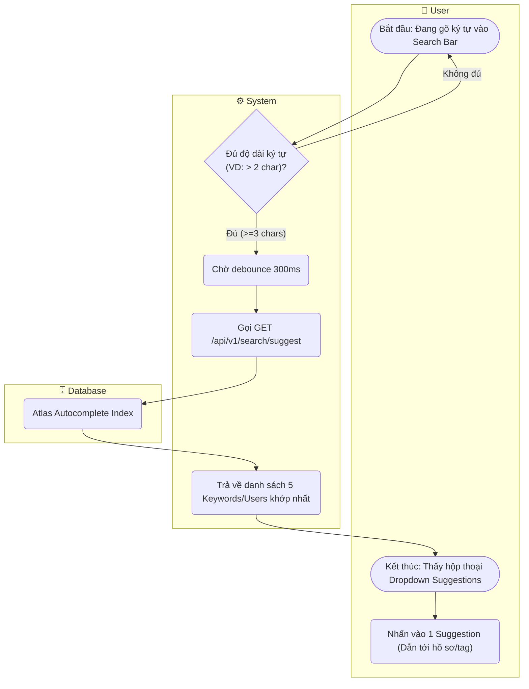

# Flow Diagram: Autocomplete Search (UC13)

## Assumptions
- Tính năng Autocomplete gọi theo cơ chế Debounce ở UI để tránh DDoS (spammed spam system).
- Trả về giới hạn số lượng nhỏ (VD: 5 item) nhằm giữ tính thời gian thực.
