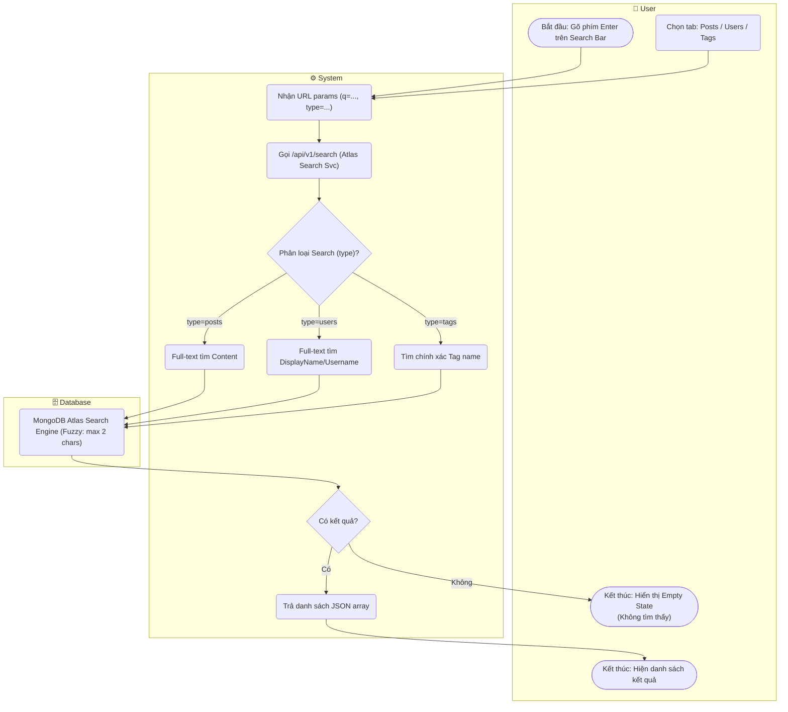

# Flow Diagram: Tìm kiếm nội dung/người dùng/tag (UC12)

## Assumptions
- Sử dụng trực tiếp MongoDB Atlas Search hoặc text index. Lớp API đóng vai trò định tuyến loại (type) content để route query Atlas cho chính xác.
