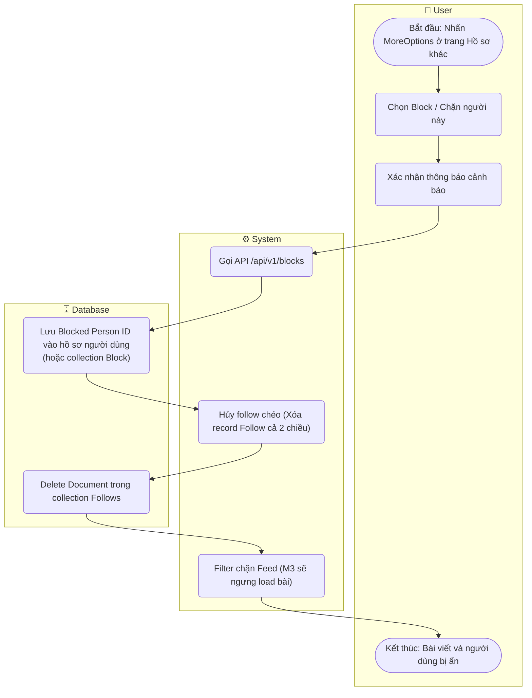

# Flow Diagram: Block người dùng (UC18)

## Assumptions
- Khi bị Block, hệ thống bắt buộc tự động "Unfollow" nếu hai người đang theo dõi nhau.
- Các API Read của Feed, Notification sẽ nhận một mảng danh sách Blocked Users để tự động query `$nin` che content độc.
