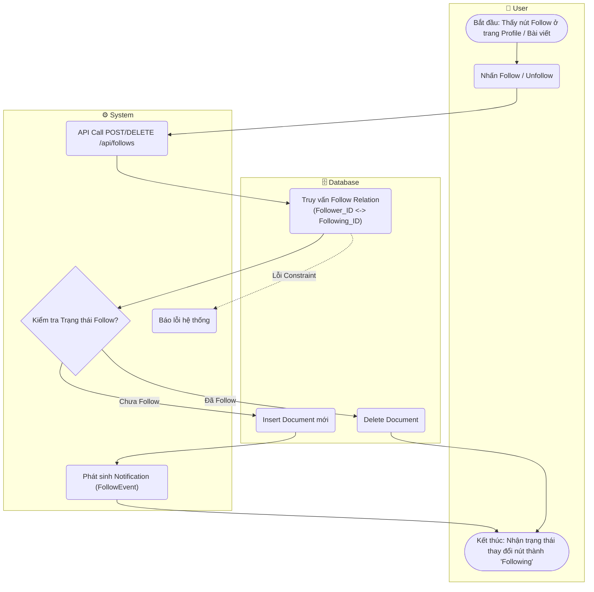

# Flow Diagram: Follow/Unfollow thành viên (UC17)

## Assumptions
- Follow Relationship dùng một collection riêng, chứa `follower_id` và `following_id`. (Đã ghi trong spec M4 Data Models: `follows`).
- Đảm bảo Unique Index.
