# Flow Diagram: Follow/Unfollow thành viên (UC17)

```mermaid
flowchart TD
  subgraph User ["👤 User"]
    direction TB
    U1(["Bắt đầu: Thấy nút Follow ở trang Profile / Bài viết"])
    U2("Nhấn Follow / Unfollow")
    U3(["Kết thúc: Nhận trạng thái thay đổi nút thành 'Following'"])
  end
  subgraph System ["⚙️ System"]
    direction TB
    S1("API Call POST/DELETE /api/follows")
    S2{"Kiểm tra Trạng thái Follow?"}
    S3("Phát sinh Notification (FollowEvent)")
    S4("Báo lỗi hệ thống")
  end
  subgraph DB ["🗄️ Database"]
    direction TB
    D1("Truy vấn Follow Relation<br/>(Follower_ID <-> Following_ID)")
    D2("Insert Document mới")
    D3("Delete Document")
  end

  U1 --> U2 --> S1 --> D1 --> S2

  S2 -- "Chưa Follow" --> D2 --> S3
  S2 -- "Đã Follow" --> D3 
  
  S3 --> U3
  D3 --> U3
  
  D1 -. Lỗi Constraint .-> S4

  %% UC-ID: UC17
  %% Business Function: Theo dõi Người dùng khác
```

## Assumptions
- Follow Relationship dùng một collection riêng, chứa `follower_id` và `following_id`. (Đã ghi trong spec M4 Data Models: `follows`).
- Đảm bảo Unique Index.
