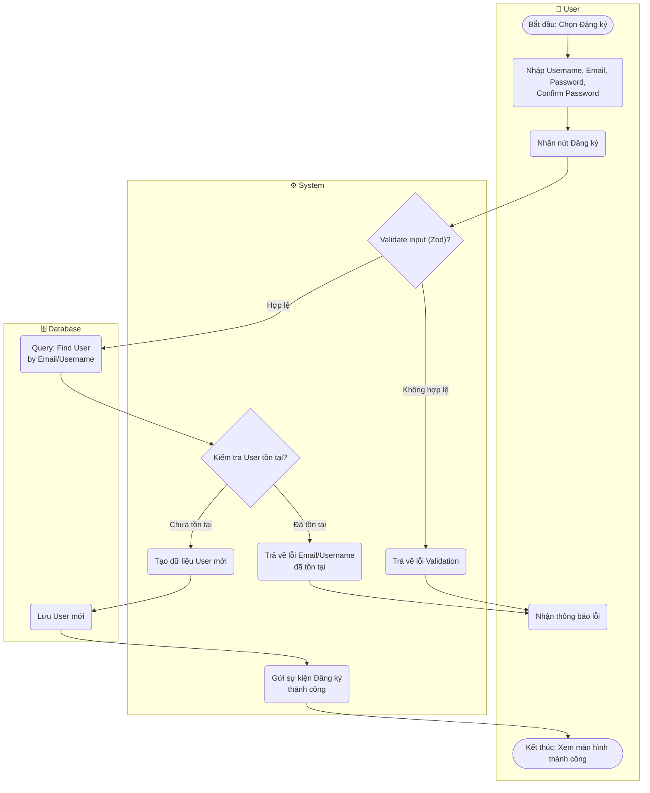

# Flow Diagram: Đăng ký tài khoản (UC01)

## Assumptions
- Dữ liệu input cần thỏa mãn Zod rule theo spec: `username` min 3 max 20, chỉ chứa a-zA-Z0-9_.
- Sau khi insert, PayloadCMS tự động tạo collection Profile qua Payload hooks (không thể hiện chi tiết ở đây, coi như gộp trong "Lưu User mới").
- Hệ thống gửi sự kiện đăng ký thành công (có thể gửi email chào mừng qua M6).
